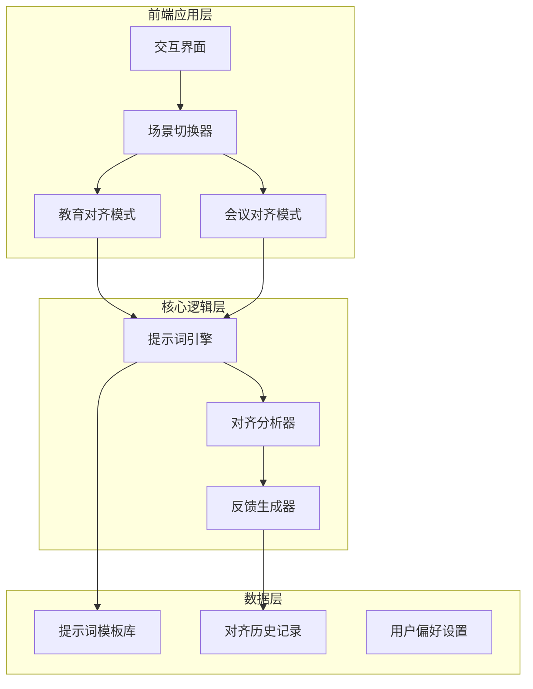

## 产品概述

以"认知对齐"为核心理念的智能学习助手产品，通过差异化的场景设计，帮助用户在不同情境下实现高效的认知同步。产品聚焦两大核心场景：教育场景（对齐老师的知识传授）和会议场景（对齐他人的观点讨论），通过优化的提示词系统、精心设计的交互体验，让"对齐"理念贯穿产品始终。

## 核心功能

- **场景化对齐模式**：教育模式专注于理解老师讲授内容的核心要点，会议模式专注于捕捉多方观点并形成共识
- **智能提示词系统**：针对不同场景优化的提示词，引导用户进行有效的认知对齐
- **实时对齐反馈**：可视化展示用户与目标（老师/他人）的认知差距，提供对齐建议
- **对齐历史追踪**：记录对齐过程，支持回顾和持续改进
- **差异化交互界面**：教育场景采用师生对话式交互，会议场景采用多方协作式交互

## 技术栈

- 前端框架：React + TypeScript
- 样式方案：Tailwind CSS
- 组件库：shadcn/ui
- 状态管理：React Hooks

## 技术架构

### 系统架构



### 模块划分

- **场景管理模块**：负责教育/会议场景的切换与状态管理
- **提示词引擎模块**：管理和优化不同场景的提示词模板
- **对齐分析模块**：分析用户输入与目标的对齐程度
- **交互组件模块**：提供差异化的场景交互组件

### 数据流

用户选择场景 → 加载对应提示词模板 → 用户输入内容 → 对齐分析处理 → 生成对齐反馈 → 界面展示结果

## 实现细节

### 核心目录结构

```
project-root/
├── src/
│   ├── components/
│   │   ├── SceneSelector.tsx      # 场景选择器组件
│   │   ├── AlignmentFeedback.tsx  # 对齐反馈展示组件
│   │   ├── EduModePanel.tsx       # 教育模式面板
│   │   └── MeetModePanel.tsx      # 会议模式面板
│   ├── prompts/
│   │   ├── education.ts           # 教育场景提示词
│   │   └── meeting.ts             # 会议场景提示词
│   ├── hooks/
│   │   └── useAlignment.ts        # 对齐状态管理Hook
│   └── types/
│       └── alignment.ts           # 类型定义
├── skills/
│   └── alignment-skill.md         # 优化后的技能文件
└── README.md                      # 重构后的文档
```

### 关键代码结构

**对齐模式类型定义**：定义产品的两种核心对齐场景及其配置。

```typescript
interface AlignmentMode {
  type: 'education' | 'meeting';
  targetRole: string;           // 对齐目标角色
  promptTemplate: string;       // 场景提示词模板
  interactionStyle: 'dialogue' | 'collaborative';
}

interface AlignmentResult {
  score: number;                // 对齐程度评分
  gaps: string[];               // 认知差距点
  suggestions: string[];        // 对齐建议
}
```

### 技术实现要点

1. **提示词优化策略**：采用场景化提示词设计，教育场景强调"理解-复述-验证"流程，会议场景强调"观点提取-差异识别-共识构建"流程
2. **交互差异化**：教育模式使用单向对话式交互，会议模式使用多卡片协作式交互
3. **反馈可视化**：使用进度条和标签展示对齐程度，直观呈现认知差距

## 设计理念

以"认知对齐"为核心视觉隐喻，采用清晰、专注的现代设计风格。通过色彩和布局的差异化，让用户直观感知不同场景的特性：教育场景采用温暖、引导性的设计语言；会议场景采用协作、平等的设计语言。

## 页面规划

### 1. 首页/场景选择页

- **顶部导航栏**：产品Logo"认知对齐"、场景切换入口、设置按钮
- **核心选择区**：两张大卡片并列展示教育模式和会议模式，配以图标和简洁描述，悬停时有微动效
- **理念展示区**：简洁的产品理念说明，强调"对齐"的核心价值
- **底部信息栏**：版本信息、帮助链接

### 2. 教育对齐模式页

- **顶部状态栏**：当前模式标识、返回按钮、对齐进度指示器
- **对话交互区**：师生对话式布局，老师内容在左侧带头像，用户理解在右侧，形成清晰的对话流
- **对齐反馈区**：实时展示对齐程度的进度条、关键差距点标签、改进建议卡片
- **输入操作区**：文本输入框、语音输入按钮、提交按钮，引导用户表达理解

### 3. 会议对齐模式页

- **顶部状态栏**：当前模式标识、参会者头像组、会议主题
- **多方观点区**：卡片式布局展示不同参会者的观点，支持标记和关联
- **共识构建区**：可视化展示已达成共识和待讨论分歧，使用连线表示关联
- **协作输入区**：支持添加自己观点、标记认同/疑问、发起讨论

### 4. 对齐历史页

- **顶部筛选栏**：按场景类型、时间范围筛选
- **历史列表区**：时间线式展示历史记录，每条包含场景类型、主题、对齐评分
- **详情预览区**：点击展开查看详细的对齐过程和结果

## 代理扩展

### SubAgent

- **code-explorer**
- 用途：深入探索现有项目的提示词文件、技能实现、前端交互代码，全面了解当前产品状态
- 预期结果：获取现有提示词内容、技能配置、组件实现的完整信息，为优化提供基础

### Skill

- **frontend-design**
- 用途：设计和实现差异化的场景交互界面，提升产品视觉和交互品质
- 预期结果：产出高质量的教育模式和会议模式交互界面，体现专业的设计水准

- **web-artifacts-builder**
- 用途：构建复杂的多组件前端界面，实现场景切换、对齐反馈等交互功能
- 预期结果：完成功能完整、交互流畅的产品界面