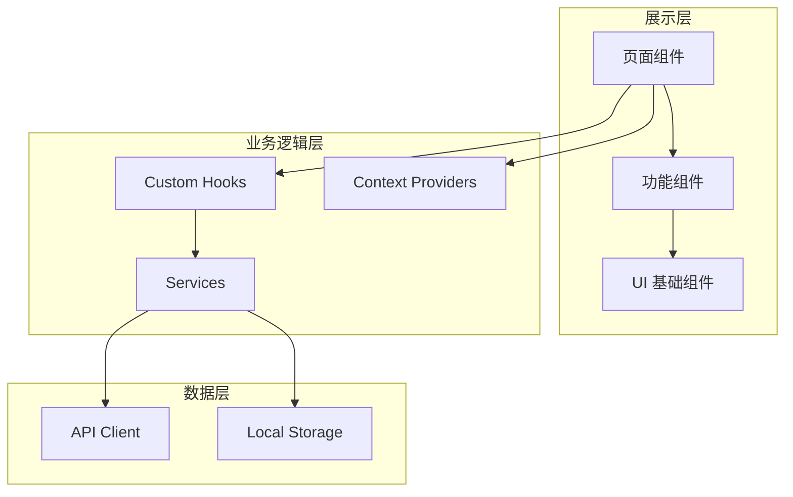

## 产品概述

将现有单文件 HTML 前端完整重构为现代化的 React + TypeScript 项目，保留所有原有功能，提升代码可维护性、可扩展性和用户体验。新项目将采用组件化架构，实现高质量的 UI 设计和完善的测试覆盖。

## 核心功能

- **录音功能**：支持浏览器端音频录制，实时显示录音状态和时长
- **语音转写**：将录音内容转换为文字，支持多语言识别
- **AI 技能模块**：集成 AI 能力，提供智能分析和处理功能
- **智能问答**：基于上下文的 AI 对话交互界面
- **数据视觉化**：图表展示和数据可视化组件
- **历史记录**：录音和对话历史的存储、查询和管理
- **用户认证**：登录、注册、会话管理和权限控制

## 技术栈

- **前端框架**：React 18 + TypeScript
- **构建工具**：Vite
- **样式方案**：Tailwind CSS
- **组件库**：shadcn/ui
- **状态管理**：React Context + Custom Hooks
- **路由**：React Router v6
- **HTTP 客户端**：Axios
- **音频处理**：Web Audio API
- **图表库**：Recharts

## 技术架构

### 系统架构

采用分层架构模式，将应用划分为展示层、业务逻辑层和数据层，确保关注点分离和代码可维护性。



### 模块划分

- **认证模块**：用户登录、注册、会话管理，依赖 API 服务
- **录音模块**：音频录制、播放控制，使用 Web Audio API
- **转写模块**：语音转文字服务调用和结果展示
- **AI 技能模块**：AI 能力集成和交互界面
- **问答模块**：对话式交互，消息列表和输入组件
- **视觉化模块**：数据图表展示，使用 Recharts
- **历史记录模块**：数据持久化和列表管理

### 数据流

用户交互 → React 组件事件处理 → Custom Hook 状态更新 → Service 层 API 调用 → 后端响应 → 状态更新 → UI 重新渲染

## 实现细节

### 核心目录结构

```
frontend/
├── src/
│   ├── components/
│   │   ├── ui/              # shadcn/ui 基础组件
│   │   ├── auth/            # 认证相关组件
│   │   ├── recorder/        # 录音功能组件
│   │   ├── transcription/   # 转写功能组件
│   │   ├── chat/            # 问答对话组件
│   │   ├── visualization/   # 数据可视化组件
│   │   └── history/         # 历史记录组件
│   ├── pages/
│   │   ├── LoginPage.tsx
│   │   ├── RegisterPage.tsx
│   │   ├── DashboardPage.tsx
│   │   ├── RecorderPage.tsx
│   │   └── HistoryPage.tsx
│   ├── hooks/
│   │   ├── useAuth.ts
│   │   ├── useRecorder.ts
│   │   ├── useTranscription.ts
│   │   └── useChat.ts
│   ├── services/
│   │   ├── api.ts
│   │   ├── authService.ts
│   │   └── audioService.ts
│   ├── contexts/
│   │   ├── AuthContext.tsx
│   │   └── AppContext.tsx
│   ├── types/
│   │   └── index.ts
│   ├── lib/
│   │   └── utils.ts
│   ├── App.tsx
│   └── main.tsx
├── public/
├── index.html
├── package.json
├── tsconfig.json
├── tailwind.config.js
└── vite.config.ts
```

### 关键代码结构

**核心类型定义**：定义应用中使用的主要数据结构，包括用户、录音、转写结果和聊天消息等实体。

```typescript
// types/index.ts
interface User {
  id: string;
  email: string;
  name: string;
}

interface Recording {
  id: string;
  blob: Blob;
  duration: number;
  createdAt: Date;
}

interface TranscriptionResult {
  id: string;
  text: string;
  language: string;
  recordingId: string;
}

interface ChatMessage {
  id: string;
  role: 'user' | 'assistant';
  content: string;
  timestamp: Date;
}
```

**录音 Hook**：封装 Web Audio API，提供录音控制和状态管理的自定义 Hook。

```typescript
// hooks/useRecorder.ts
interface UseRecorderReturn {
  isRecording: boolean;
  duration: number;
  startRecording: () => Promise<void>;
  stopRecording: () => Promise<Blob>;
  pauseRecording: () => void;
}
```

### 技术实现要点

1. **音频录制**：使用 MediaRecorder API 实现浏览器端录音，支持暂停和恢复
2. **实时状态**：通过 React Context 管理全局状态，Custom Hooks 封装业务逻辑
3. **API 集成**：Axios 实例统一处理请求拦截、错误处理和认证 Token
4. **响应式设计**：Tailwind CSS 实现移动端适配

### 集成点

- 与现有后端 API 保持兼容，必要时协调 API 调整
- 认证使用 JWT Token，存储于 localStorage
- 音频文件通过 FormData 上传至后端

## 设计风格

采用现代简约风格，结合 Glassmorphism 元素，打造专业、高效的工作应用界面。整体设计注重清晰的信息层级、流畅的交互体验和舒适的视觉感受。

## 页面规划

### 1. 登录/注册页

- 顶部：应用 Logo 和品牌名称
- 中部：毛玻璃效果的表单卡片，包含输入框和提交按钮
- 底部：切换登录/注册的链接
- 背景：渐变色彩配合微妙的动态效果

### 2. 主控制台页 (Dashboard)

- 顶部导航栏：Logo、用户头像、设置入口
- 左侧边栏：功能模块导航（录音、历史、设置）
- 主内容区：快捷操作卡片、最近录音列表、使用统计图表
- 底部：状态栏显示连接状态

### 3. 录音页

- 顶部：返回按钮、页面标题
- 中部：大型录音按钮，带脉冲动画效果；实时波形可视化；时长显示
- 下方：录音控制按钮组（暂停、停止、取消）
- 底部：最近录音快捷访问

### 4. 转写与问答页

- 顶部：标签切换（转写结果/AI问答）
- 转写区：文本展示卡片，支持复制和编辑
- 问答区：聊天消息列表，底部输入框
- 侧边：AI 技能快捷操作面板

### 5. 历史记录页

- 顶部：搜索栏和筛选器
- 列表区：录音卡片列表，显示标题、时长、日期
- 卡片操作：播放、查看转写、删除
- 分页或无限滚动加载

## 交互设计

- 按钮悬停时有微妙的缩放和阴影变化
- 页面切换使用平滑的淡入淡出过渡
- 录音时按钮呈现脉冲呼吸动画
- 加载状态使用骨架屏占位
- 表单验证实时反馈

## Agent Extensions

### Skill

- **frontend-design**
- 用途：设计高质量的 React 组件和页面 UI，确保视觉效果现代化、专业
- 预期成果：生成美观、可用的 React + TypeScript + Tailwind CSS 组件代码

- **web-artifacts-builder**
- 用途：构建复杂的多组件 React 应用，使用 shadcn/ui 组件库
- 预期成果：完整的 React 项目结构，包含路由、状态管理和 UI 组件

- **webapp-testing**
- 用途：使用 Playwright 对重构后的应用进行全面的功能测试
- 预期成果：验证所有功能正常工作，捕获测试截图，确保无回归问题

### SubAgent

- **code-explorer**
- 用途：深入分析现有 HTML 文件的代码结构、功能实现和 API 调用
- 预期成果：完整理解原有功能逻辑，确保重构时不遗漏任何功能