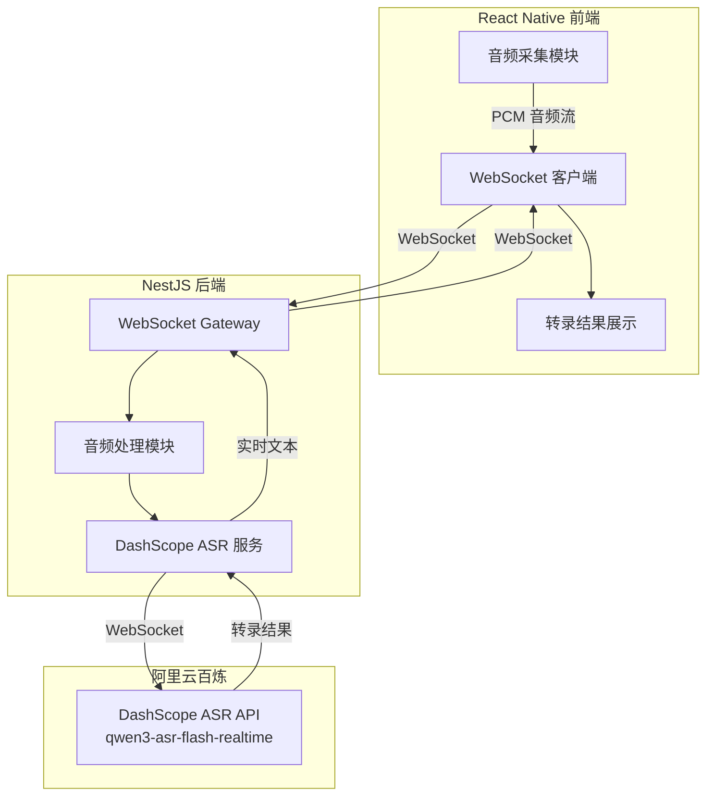
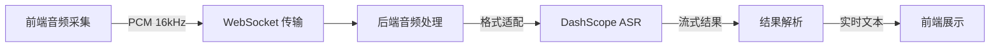

## Product Overview

将当前项目的语音转文本服务从阿里云通义听悟 (Tingwu) 完全替换为阿里云百炼 DashScope ASR (qwen3-asr-flash-realtime)，实现实时流式语音转录功能。同时借鉴 MeetMind 项目的音频处理优化方案，提升音频采集和处理质量。

## Core Features

- **DashScope ASR WebSocket 实时转录**：使用 qwen3-asr-flash-realtime 模型，通过 WebSocket 协议实现实时流式语音转文本
- **音频处理优化**：借鉴 MeetMind 的音频采集和预处理方案，优化音频格式、采样率和缓冲策略
- **服务层完全替换**：移除通义听悟相关代码，重构为 DashScope ASR 服务架构
- **前端音频流适配**：React Native 端适配新的音频格式要求和 WebSocket 通信协议

## Tech Stack

- 后端框架：NestJS (TypeScript)
- 前端框架：React Native
- ASR 服务：阿里云百炼 DashScope ASR (qwen3-asr-flash-realtime)
- 通信协议：WebSocket (实时流式传输)

## Tech Architecture

### System Architecture

架构模式：分层架构，保持现有 NestJS + React Native 架构不变，仅替换 ASR 服务层



### Module Division

- **DashScope ASR 服务模块**
- 职责：管理与百炼 ASR 的 WebSocket 连接，处理音频数据发送和转录结果接收
- 技术：WebSocket 客户端、DashScope API 协议
- 接口：`startTranscription()`, `sendAudioChunk()`, `stopTranscription()`

- **音频处理模块**
- 职责：音频格式转换、采样率调整、缓冲策略优化
- 技术：借鉴 MeetMind 的音频处理方案
- 依赖：DashScope ASR 服务模块

- **WebSocket Gateway 模块**
- 职责：管理前后端 WebSocket 连接，转发音频数据和转录结果
- 技术：NestJS WebSocket Gateway
- 依赖：DashScope ASR 服务模块

### Data Flow



## Implementation Details

### Core Directory Structure

仅展示需要修改或新增的文件：

```
project-root/
├── src/
│   ├── services/
│   │   ├── dashscope-asr.service.ts    # 新增：DashScope ASR 服务
│   │   ├── audio-processor.service.ts  # 新增：音频处理服务
│   │   └── tingwu.service.ts           # 删除：通义听悟服务
│   ├── gateways/
│   │   └── transcription.gateway.ts    # 修改：适配新 ASR 服务
│   ├── types/
│   │   └── dashscope-asr.types.ts      # 新增：DashScope ASR 类型定义
│   └── config/
│       └── dashscope.config.ts         # 新增：DashScope 配置
```

### Key Code Structures

**DashScope ASR 配置接口**：定义百炼 ASR 服务的连接参数和音频格式要求。

```typescript
interface DashScopeASRConfig {
  apiKey: string;
  model: 'qwen3-asr-flash-realtime';
  wsEndpoint: string;
  audioFormat: {
    sampleRate: 16000;
    channels: 1;
    encoding: 'pcm';
  };
}
```

**DashScope ASR 服务类**：封装与百炼 ASR 的 WebSocket 通信逻辑，管理实时转录会话。

```typescript
class DashScopeASRService {
  async createSession(taskId: string): Promise<ASRSession> { }
  async sendAudioChunk(sessionId: string, audioData: Buffer): Promise<void> { }
  async closeSession(sessionId: string): Promise<TranscriptionResult> { }
  onTranscriptionUpdate(callback: (result: PartialResult) => void): void { }
}
```

**音频处理服务**：借鉴 MeetMind 的音频优化方案，处理音频格式转换和缓冲。

```typescript
class AudioProcessorService {
  processAudioChunk(rawAudio: Buffer, sourceFormat: AudioFormat): Buffer { }
  createAudioBuffer(chunkSize: number): AudioBuffer { }
  resampleAudio(audio: Buffer, targetRate: number): Buffer { }
}
```

### Technical Implementation Plan

1. **DashScope ASR WebSocket 集成**

- 问题：需要实现与百炼 ASR 的 WebSocket 实时通信
- 方案：基于 DashScope API 文档实现 WebSocket 客户端，支持双向流式传输
- 步骤：创建连接管理器 → 实现消息协议 → 处理流式响应 → 错误重连机制

2. **音频处理优化**

- 问题：确保音频格式符合 DashScope ASR 要求
- 方案：借鉴 MeetMind 的音频处理方案，实现格式转换和缓冲优化
- 步骤：分析 MeetMind 方案 → 适配当前项目 → 实现音频预处理管道

3. **服务层重构**

- 问题：完全移除通义听悟依赖，替换为 DashScope ASR
- 方案：保持接口兼容性，最小化对上层代码的影响
- 步骤：定义新接口 → 实现 DashScope 服务 → 更新 Gateway → 移除旧代码

### Integration Points

- **前后端通信**：WebSocket 协议，JSON 格式消息
- **DashScope API**：WebSocket 协议，遵循百炼 ASR API 规范
- **认证**：使用 DashScope API Key 进行身份验证

## Agent Extensions

### SubAgent

- **code-explorer**
- Purpose：探索当前项目结构，分析现有通义听悟服务实现和 MeetMind 音频处理方案
- Expected outcome：获取现有 ASR 服务代码结构、WebSocket Gateway 实现细节，以及 MeetMind 音频处理优化的具体实现方式