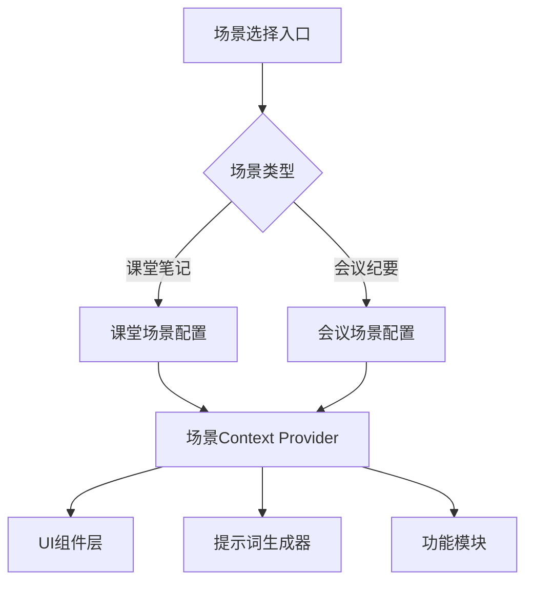

## Product Overview

一个智能语音转录应用的场景化优化方案，针对"大学生听课"和"职场人士开会"两个核心场景进行深度差异化设计。用户在每次新建会话时选择场景，系统根据场景自动适配提示词风格、功能侧重点和UI文案。

## Core Features

- **场景选择入口**：新建会话时展示场景选择界面，提供"课堂笔记"和"会议纪要"两个场景卡片
- **差异化提示词系统**：课堂场景采用轻松活泼风格，会议场景采用专业简洁风格
- **功能侧重适配**：课堂场景侧重知识点提取和"老师言外之意解读"；会议场景侧重待办事项和决策追踪
- **UI文案全面适配**：按钮、标题、提示语等根据场景动态变化，营造沉浸式体验

## Tech Stack

- 前端框架：React + TypeScript
- 样式方案：Tailwind CSS
- 组件库：shadcn/ui
- 状态管理：React Context + Hooks

## Tech Architecture

### System Architecture

采用分层架构，将场景配置与业务逻辑分离，便于扩展新场景。



### Module Division

- **场景配置模块**：定义各场景的提示词模板、功能开关、UI文案映射
- **场景选择模块**：新建会话时的场景选择界面
- **动态UI模块**：根据当前场景渲染对应文案和样式

### Data Flow

用户选择场景 → 场景配置加载到Context → 各组件从Context读取配置 → 动态渲染UI和功能

## Implementation Details

### Core Directory Structure

```
src/
├── config/
│   └── scenarios.ts          # 场景配置定义
├── contexts/
│   └── ScenarioContext.tsx   # 场景状态管理
├── components/
│   ├── ScenarioSelector.tsx  # 场景选择组件
│   └── DynamicUI.tsx         # 动态文案组件
└── hooks/
    └── useScenario.ts        # 场景Hook
```

### Key Code Structures

**场景配置接口**：定义场景的完整配置结构，包含ID、名称、图标、提示词模板、功能开关和UI文案映射。

```typescript
interface ScenarioConfig {
  id: 'classroom' | 'meeting';
  name: string;
  icon: string;
  description: string;
  promptStyle: {
    tone: string;
    keywords: string[];
  };
  features: {
    keyPointExtraction: boolean;
    impliedMeaning: boolean;  // 老师言外之意解读
    todoTracking: boolean;
    decisionTracking: boolean;
  };
  uiTexts: Record<string, string>;
}
```

**场景配置示例**：

```typescript
const classroomConfig: ScenarioConfig = {
  id: 'classroom',
  name: '课堂笔记',
  promptStyle: { tone: '轻松活泼，像学霸同学帮你划重点' },
  features: { impliedMeaning: true, keyPointExtraction: true },
  uiTexts: {
    startButton: '开始听课',
    summaryTitle: '课堂精华',
    insightLabel: '老师言外之意'
  }
};

const meetingConfig: ScenarioConfig = {
  id: 'meeting',
  name: '会议纪要',
  promptStyle: { tone: '专业简洁，直击要点' },
  features: { todoTracking: true, decisionTracking: true },
  uiTexts: {
    startButton: '开始会议',
    summaryTitle: '会议摘要',
    insightLabel: '关键决策'
  }
};
```

## Design Style

采用现代卡片式设计，通过视觉差异化强化场景区分。课堂场景使用温暖活力的色调，会议场景使用专业沉稳的色调。

## Page Planning

### 场景选择页

- **顶部区域**：标题"选择你的场景"，副标题简要说明场景化体验
- **场景卡片区**：两张大尺寸场景卡片并排展示，悬停时有微动效
- 课堂笔记卡片：书本图标，橙黄暖色调，文案"像学霸帮你划重点"
- 会议纪要卡片：公文包图标，蓝灰冷色调，文案"高效记录每个决策"
- **底部提示**：说明可随时切换场景

### 主界面适配

- 根据场景动态切换主色调、按钮文案、功能模块显示
- 课堂场景显示"老师言外之意解读"模块
- 会议场景显示"待办事项"和"决策追踪"模块

## Agent Extensions

### SubAgent

- **code-explorer**
- Purpose: 探索现有项目结构，了解当前代码架构和已有组件
- Expected outcome: 获取项目目录结构、现有组件和配置文件信息，确保新功能与现有架构一致

### Skill

- **frontend-design**
- Purpose: 设计场景选择界面和差异化UI组件
- Expected outcome: 创建美观、区分度高的场景选择卡片和适配各场景的UI样式