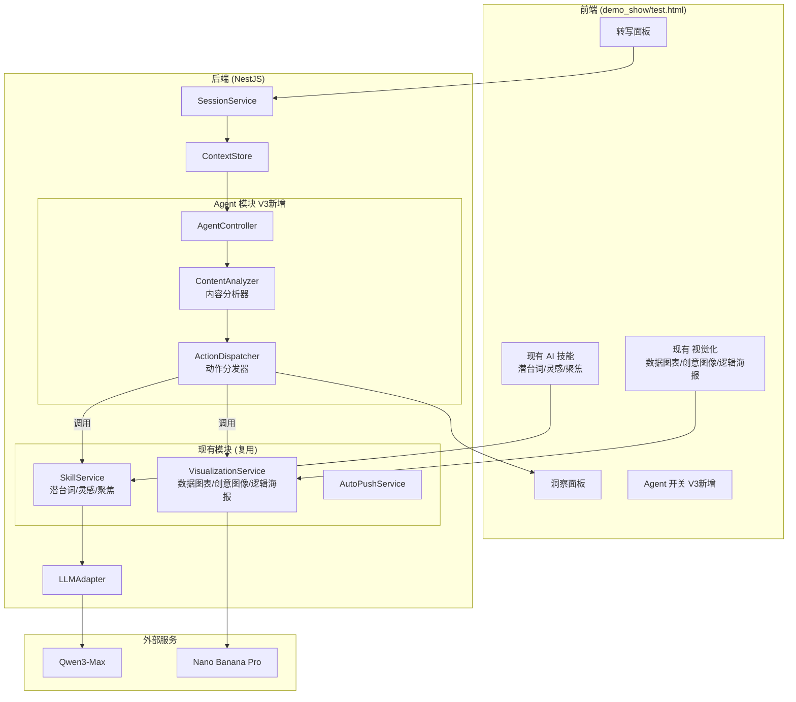
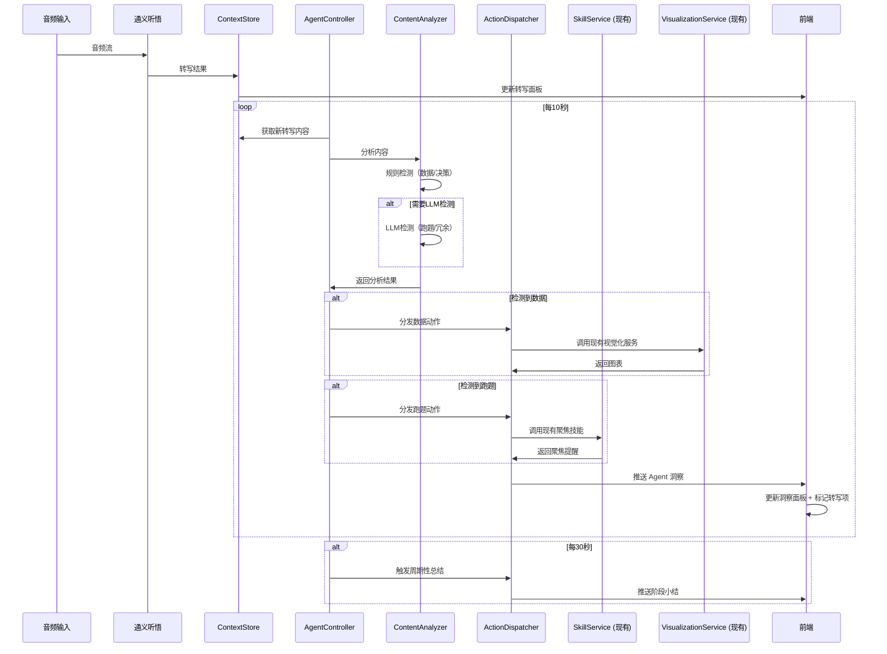

# 技术方案设计: 会议快照 V3 - Agent-Flow 智能联动系统

## 1. 问题分析

### 1.1 现状痛点

当前系统存在"左右分离"的问题：
- **左侧转写面板**：流水账式的实时转写，像速记员在记录
- **右侧洞察面板**：碎片化的分析卡片，像另一个分析师在独立工作
- **两者之间没有流动（Flow）**：各干各的，缺乏联动

### 1.2 理想状态

真正的魔法应该是：
- 当左边有人说到**关键数据**时，右边**自动浮现出一个图表**
- 当有人在**胡扯/兜圈子**时，右边**悄悄告诉你"他在兜圈子"**
- 每隔一段时间，右边**自动输出总结性话语**
- 转写与洞察之间有**视觉关联**，让用户知道"这条洞察是基于哪段对话生成的"

## 2. 核心设计理念：Agent-Flow 架构

### 2.1 Agent 概念

将系统设计为一个**智能 Agent**，具备以下能力：
- **感知（Perception）**：实时监听转写流，理解对话内容
- **决策（Decision）**：根据规则和上下文，判断何时触发什么动作
- **执行（Action）**：自动调用现有功能（技能、视觉化）生成洞察

### 2.2 Agent-Flow 流程图

```
┌─────────────────────────────────────────────────────────────────────────────┐
│                           Agent-Flow 智能联动系统                            │
├─────────────────────────────────────────────────────────────────────────────┤
│                                                                             │
│  ┌─────────────┐    ┌─────────────────────────────────────────────────┐    │
│  │   转写流     │───▶│              Agent Controller                   │    │
│  │  (实时输入)  │    │  ┌─────────────────────────────────────────┐   │    │
│  └─────────────┘    │  │         Content Analyzer                 │   │    │
│                     │  │  • 数据检测 (数字/百分比/金额/趋势)      │   │    │
│                     │  │  • 跑题检测 (话题偏离主线)               │   │    │
│                     │  │  • 冗余检测 (重复表述/兜圈子)            │   │    │
│                     │  │  • 决策检测 (决策关键词)                 │   │    │
│                     │  │  • 周期性触发 (每30秒)                   │   │    │
│                     │  └─────────────────────────────────────────┘   │    │
│                     │                      │                          │    │
│                     │                      ▼                          │    │
│                     │  ┌─────────────────────────────────────────┐   │    │
│                     │  │         Action Dispatcher                │   │    │
│                     │  │  根据检测结果，自动调用对应功能          │   │    │
│                     │  └─────────────────────────────────────────┘   │    │
│                     └──────────────────────┬──────────────────────────┘    │
│                                            │                                │
│                     ┌──────────────────────┼──────────────────────┐        │
│                     │                      │                      │        │
│                     ▼                      ▼                      ▼        │
│  ┌──────────────────────┐  ┌──────────────────────┐  ┌──────────────────┐  │
│  │   现有 AI 技能        │  │   现有 视觉化功能     │  │   周期性总结     │  │
│  │  ┌────────────────┐  │  │  ┌────────────────┐  │  │                  │  │
│  │  │ 🔮 潜台词       │  │  │  │ 📊 数据图表    │◀─┼──│  Agent 自动触发  │  │
│  │  │ ⚡ 灵感         │  │  │  │ 🎨 创意图像    │  │  │  生成阶段小结    │  │
│  │  │ 🎯 聚焦         │  │  │  │ 📋 逻辑海报    │  │  │                  │  │
│  │  └────────────────┘  │  │  └────────────────┘  │  └──────────────────┘  │
│  │   Agent 可自动触发   │  │   Agent 可自动触发   │                        │
│  └──────────────────────┘  └──────────────────────┘                        │
│                     │                      │                      │        │
│                     └──────────────────────┴──────────────────────┘        │
│                                            │                                │
│                                            ▼                                │
│                     ┌─────────────────────────────────────────────────┐    │
│                     │              洞察面板 (右侧)                      │    │
│                     │  • 自动洞察卡片（带来源关联）                    │    │
│                     │  • 自动生成的图表                               │    │
│                     │  • 周期性总结                                   │    │
│                     └─────────────────────────────────────────────────┘    │
│                                                                             │
└─────────────────────────────────────────────────────────────────────────────┘
```

## 3. 系统架构

### 3.1 后端架构



### 3.2 核心设计原则

1. **复用优先**：Agent 不重新实现功能，而是调用现有的 SkillService 和 VisualizationService
2. **最小侵入**：在现有代码基础上增加 Agent 模块，不修改现有功能逻辑
3. **可控性**：用户可以开启/关闭 Agent 自动联动功能

## 4. 核心模块设计

### 4.1 AgentController - Agent 控制器

```typescript
// src/modules/agent/agent.controller.ts

@Injectable()
export class AgentController {
  private readonly logger = new Logger(AgentController.name);
  private readonly sessions = new Map<string, {
    intervalId: NodeJS.Timeout;
    enabled: boolean;
    lastAnalyzedIndex: number;  // 上次分析到的转写索引
    lastSummaryTime: number;    // 上次总结时间
  }>();

  constructor(
    private readonly contextStore: ContextStoreService,
    private readonly contentAnalyzer: ContentAnalyzerService,
    private readonly actionDispatcher: ActionDispatcherService,
  ) {}

  /**
   * 启动 Agent 监控
   */
  startAgent(sessionId: string, callback: (insight: AgentInsight) => void): void {
    if (this.sessions.has(sessionId)) {
      return;
    }

    const intervalId = setInterval(async () => {
      await this.runAgentCycle(sessionId, callback);
    }, 10000); // 每10秒运行一次 Agent 循环

    this.sessions.set(sessionId, {
      intervalId,
      enabled: true,
      lastAnalyzedIndex: 0,
      lastSummaryTime: Date.now(),
    });

    this.logger.log(`Agent started for session ${sessionId}`);
  }

  /**
   * 停止 Agent 监控
   */
  stopAgent(sessionId: string): void {
    const session = this.sessions.get(sessionId);
    if (session) {
      clearInterval(session.intervalId);
      this.sessions.delete(sessionId);
      this.logger.log(`Agent stopped for session ${sessionId}`);
    }
  }

  /**
   * Agent 主循环
   */
  private async runAgentCycle(
    sessionId: string,
    callback: (insight: AgentInsight) => void
  ): Promise<void> {
    const session = this.sessions.get(sessionId);
    if (!session?.enabled) return;

    // 1. 获取新的转写内容
    const segments = this.contextStore.getSegments(sessionId);
    const newSegments = segments.slice(session.lastAnalyzedIndex);
    
    if (newSegments.length === 0) return;

    // 2. 内容分析
    const analysisResults = await this.contentAnalyzer.analyze(sessionId, newSegments);

    // 3. 根据分析结果分发动作
    for (const result of analysisResults) {
      const insight = await this.actionDispatcher.dispatch(sessionId, result);
      if (insight) {
        callback(insight);
      }
    }

    // 4. 检查是否需要周期性总结（每30秒）
    const now = Date.now();
    if (now - session.lastSummaryTime >= 30000) {
      const summaryInsight = await this.actionDispatcher.dispatchPeriodicSummary(sessionId);
      if (summaryInsight) {
        callback(summaryInsight);
      }
      session.lastSummaryTime = now;
    }

    // 5. 更新分析进度
    session.lastAnalyzedIndex = segments.length;
  }
}
```

### 4.2 ContentAnalyzerService - 内容分析器

```typescript
// src/modules/agent/content-analyzer.service.ts

export type AnalysisType = 
  | 'data_mention'      // 关键数据
  | 'off_topic'         // 跑题
  | 'redundancy'        // 冗余/兜圈子
  | 'decision_point';   // 决策时刻

export interface AnalysisResult {
  type: AnalysisType;
  confidence: number;
  triggerSegmentIds: string[];
  context: string;
  metadata?: {
    matches?: string[];        // 匹配到的数据
    chartType?: string;        // 推荐的图表类型
    reason?: string;           // 检测原因
  };
}

@Injectable()
export class ContentAnalyzerService {
  private readonly cooldowns = new Map<string, number>(); // sessionId-type -> lastTriggerTime

  constructor(
    private readonly llmAdapter: LLMAdapterService,
  ) {}

  /**
   * 分析转写内容
   */
  async analyze(sessionId: string, segments: ContextSegment[]): Promise<AnalysisResult[]> {
    const results: AnalysisResult[] = [];
    const text = segments.map(s => s.text).join('\n');

    // 1. 数据检测（正则 + 关键词，快速）
    const dataResult = this.detectData(sessionId, segments, text);
    if (dataResult) results.push(dataResult);

    // 2. 决策检测（关键词，快速）
    const decisionResult = this.detectDecision(sessionId, segments, text);
    if (decisionResult) results.push(decisionResult);

    // 3. 跑题/冗余检测（LLM，较慢，合并调用）
    if (this.shouldRunLLMDetection(sessionId)) {
      const llmResults = await this.detectWithLLM(sessionId, segments, text);
      results.push(...llmResults);
    }

    return results;
  }

  /**
   * 数据检测 - 使用正则和关键词
   */
  private detectData(sessionId: string, segments: ContextSegment[], text: string): AnalysisResult | null {
    if (this.isInCooldown(sessionId, 'data_mention', 60000)) return null;

    const patterns = [
      /\d+(\.\d+)?%/g,                      // 百分比
      /\d{1,3}(,\d{3})*(\.\d+)?[万亿]?/g,   // 金额/数量
      /Q[1-4]|第[一二三四]季度/g,           // 季度
      /同比|环比|增长|下降|提升/g,          // 趋势词
    ];

    const matches: string[] = [];
    for (const pattern of patterns) {
      const found = text.match(pattern);
      if (found) matches.push(...found);
    }

    if (matches.length >= 2) {  // 至少匹配到2个数据点
      this.updateCooldown(sessionId, 'data_mention');
      return {
        type: 'data_mention',
        confidence: Math.min(0.6 + matches.length * 0.1, 1.0),
        triggerSegmentIds: segments.map(s => s.id),
        context: text,
        metadata: {
          matches,
          chartType: this.inferChartType(matches, text),
        },
      };
    }

    return null;
  }

  /**
   * 推断图表类型
   */
  private inferChartType(matches: string[], text: string): string {
    if (text.includes('对比') || text.includes('比较')) return 'bar';
    if (text.includes('趋势') || text.includes('变化')) return 'line';
    if (text.includes('占比') || text.includes('比例')) return 'radar';
    if (matches.some(m => m.includes('%'))) return 'radar';
    return 'bar';
  }

  /**
   * 决策检测 - 使用关键词
   */
  private detectDecision(sessionId: string, segments: ContextSegment[], text: string): AnalysisResult | null {
    if (this.isInCooldown(sessionId, 'decision_point', 60000)) return null;

    const keywords = ['决定', '确定', '定了', '就这样', '达成共识', '同意', '通过', '敲定', '拍板'];
    const matched = keywords.filter(kw => text.includes(kw));

    if (matched.length > 0) {
      this.updateCooldown(sessionId, 'decision_point');
      return {
        type: 'decision_point',
        confidence: Math.min(0.7 + matched.length * 0.1, 1.0),
        triggerSegmentIds: segments.map(s => s.id),
        context: text,
        metadata: { matches: matched },
      };
    }

    return null;
  }

  /**
   * LLM 检测 - 跑题和冗余
   */
  private async detectWithLLM(
    sessionId: string,
    segments: ContextSegment[],
    text: string
  ): Promise<AnalysisResult[]> {
    const results: AnalysisResult[] = [];

    const prompt = `分析以下会议对话片段：

${text}

请判断：
1. 是否存在跑题（偏离主要议题）
2. 是否存在冗余（重复表述、兜圈子）

返回JSON格式：
{
  "offTopic": { "detected": true/false, "confidence": 0-1, "reason": "原因" },
  "redundancy": { "detected": true/false, "confidence": 0-1, "reason": "原因" }
}`;

    try {
      const response = await this.llmAdapter.chatForJson<{
        offTopic: { detected: boolean; confidence: number; reason: string };
        redundancy: { detected: boolean; confidence: number; reason: string };
      }>([
        { role: 'system', content: '你是会议分析专家，擅长识别会议中的问题。' },
        { role: 'user', content: prompt },
      ]);

      if (response?.offTopic?.detected && response.offTopic.confidence >= 0.7) {
        if (!this.isInCooldown(sessionId, 'off_topic', 120000)) {
          this.updateCooldown(sessionId, 'off_topic');
          results.push({
            type: 'off_topic',
            confidence: response.offTopic.confidence,
            triggerSegmentIds: segments.map(s => s.id),
            context: text,
            metadata: { reason: response.offTopic.reason },
          });
        }
      }

      if (response?.redundancy?.detected && response.redundancy.confidence >= 0.7) {
        if (!this.isInCooldown(sessionId, 'redundancy', 90000)) {
          this.updateCooldown(sessionId, 'redundancy');
          results.push({
            type: 'redundancy',
            confidence: response.redundancy.confidence,
            triggerSegmentIds: segments.map(s => s.id),
            context: text,
            metadata: { reason: response.redundancy.reason },
          });
        }
      }
    } catch (error) {
      // LLM 调用失败，静默处理
    }

    return results;
  }

  // 冷却时间管理
  private isInCooldown(sessionId: string, type: string, cooldownMs: number): boolean {
    const key = `${sessionId}-${type}`;
    const lastTrigger = this.cooldowns.get(key) || 0;
    return Date.now() - lastTrigger < cooldownMs;
  }

  private updateCooldown(sessionId: string, type: string): void {
    this.cooldowns.set(`${sessionId}-${type}`, Date.now());
  }

  private shouldRunLLMDetection(sessionId: string): boolean {
    // 每60秒最多运行一次 LLM 检测
    return !this.isInCooldown(sessionId, 'llm_detection', 60000);
  }
}
```

### 4.3 ActionDispatcherService - 动作分发器

**关键设计：复用现有功能**

```typescript
// src/modules/agent/action-dispatcher.service.ts

export interface AgentInsight {
  id: string;
  sessionId: string;
  type: 'data_chart' | 'focus_reminder' | 'redundancy_hint' | 'decision_record' | 'periodic_summary';
  triggerSegmentIds: string[];
  content: any;
  visualization?: {
    type: 'chart' | 'creative' | 'poster';
    imageUrl?: string;
    imageBase64?: string;
  };
  createdAt: Date;
  isAuto: true;  // 标记为自动生成
}

@Injectable()
export class ActionDispatcherService {
  constructor(
    private readonly skillService: SkillService,           // 复用现有技能服务
    private readonly visualizationService: VisualizationService,  // 复用现有视觉化服务
    private readonly contextStore: ContextStoreService,
    private readonly llmAdapter: LLMAdapterService,
  ) {}

  /**
   * 根据分析结果分发动作
   */
  async dispatch(sessionId: string, result: AnalysisResult): Promise<AgentInsight | null> {
    switch (result.type) {
      case 'data_mention':
        return this.handleDataMention(sessionId, result);
      case 'off_topic':
        return this.handleOffTopic(sessionId, result);
      case 'redundancy':
        return this.handleRedundancy(sessionId, result);
      case 'decision_point':
        return this.handleDecision(sessionId, result);
      default:
        return null;
    }
  }

  /**
   * 处理数据提及 - 自动生成图表
   * 关键：调用现有的 VisualizationService
   */
  private async handleDataMention(sessionId: string, result: AnalysisResult): Promise<AgentInsight> {
    const chartType = result.metadata?.chartType || 'bar';
    
    // 调用现有的视觉化服务生成图表
    let visualization: AgentInsight['visualization'];
    try {
      const visResult = await this.visualizationService.generateVisualization({
        sessionId,
        type: 'chart',
        chartType: chartType as any,
      });
      visualization = {
        type: 'chart',
        imageUrl: visResult.imageUrl,
        imageBase64: visResult.imageBase64,
      };
    } catch (error) {
      // 图表生成失败，继续生成文字洞察
    }

    // 生成数据摘要
    const summary = await this.generateDataSummary(result.context, result.metadata?.matches || []);

    return {
      id: `agent-${Date.now()}`,
      sessionId,
      type: 'data_chart',
      triggerSegmentIds: result.triggerSegmentIds,
      content: {
        title: '📊 数据洞察',
        summary,
        dataPoints: result.metadata?.matches,
      },
      visualization,
      createdAt: new Date(),
      isAuto: true,
    };
  }

  /**
   * 处理跑题 - 调用现有的 stop_talking 技能
   * 关键：复用 SkillService.triggerSkill
   */
  private async handleOffTopic(sessionId: string, result: AnalysisResult): Promise<AgentInsight> {
    // 调用现有的聚焦技能
    const skillResult = await this.skillService.triggerSkill(sessionId, 'stop_talking');

    return {
      id: `agent-${Date.now()}`,
      sessionId,
      type: 'focus_reminder',
      triggerSegmentIds: result.triggerSegmentIds,
      content: {
        title: '🎯 聚焦提醒',
        ...skillResult.content,
        autoReason: result.metadata?.reason,
      },
      createdAt: new Date(),
      isAuto: true,
    };
  }

  /**
   * 处理冗余
   */
  private async handleRedundancy(sessionId: string, result: AnalysisResult): Promise<AgentInsight> {
    return {
      id: `agent-${Date.now()}`,
      sessionId,
      type: 'redundancy_hint',
      triggerSegmentIds: result.triggerSegmentIds,
      content: {
        title: '💬 精简建议',
        hint: '检测到重复表述',
        reason: result.metadata?.reason,
        suggestion: '建议聚焦核心要点，避免重复',
      },
      createdAt: new Date(),
      isAuto: true,
    };
  }

  /**
   * 处理决策时刻
   */
  private async handleDecision(sessionId: string, result: AnalysisResult): Promise<AgentInsight> {
    const decisionSummary = await this.generateDecisionSummary(result.context);

    return {
      id: `agent-${Date.now()}`,
      sessionId,
      type: 'decision_record',
      triggerSegmentIds: result.triggerSegmentIds,
      content: {
        title: '✅ 决策记录',
        ...decisionSummary,
      },
      createdAt: new Date(),
      isAuto: true,
    };
  }

  /**
   * 周期性总结（每30秒）
   */
  async dispatchPeriodicSummary(sessionId: string): Promise<AgentInsight | null> {
    const recentText = this.contextStore.getRecentText(sessionId, 1); // 最近1分钟
    if (!recentText || recentText.length < 50) return null;

    const summary = await this.llmAdapter.chatWithPrompt(
      '你是会议摘要专家，擅长用一句话概括会议进展。',
      `请用一句话（不超过50字）总结以下会议内容的核心进展：\n\n${recentText}\n\n直接返回总结内容。`
    );

    return {
      id: `agent-${Date.now()}`,
      sessionId,
      type: 'periodic_summary',
      triggerSegmentIds: [],
      content: {
        title: '📝 阶段小结',
        summary: summary || '会议进行中...',
        timestamp: new Date().toLocaleTimeString('zh-CN'),
      },
      createdAt: new Date(),
      isAuto: true,
    };
  }

  // 辅助方法
  private async generateDataSummary(context: string, matches: string[]): Promise<string> {
    const prompt = `根据以下对话内容，用一句话总结提到的数据要点：\n\n${context}\n\n检测到的数据：${matches.join(', ')}\n\n直接返回总结。`;
    return await this.llmAdapter.chatWithPrompt('你是数据分析专家。', prompt) || '检测到关键数据';
  }

  private async generateDecisionSummary(context: string): Promise<{ decision: string; nextSteps?: string[] }> {
    const prompt = `从以下对话中提取决策要点：\n\n${context}\n\n返回JSON：{"decision":"决策内容","nextSteps":["后续行动"]}`;
    try {
      return await this.llmAdapter.chatForJson([
        { role: 'system', content: '你是会议记录专家。' },
        { role: 'user', content: prompt },
      ]) || { decision: '达成决策' };
    } catch {
      return { decision: '达成决策' };
    }
  }
}
```

## 5. 前端设计

### 5.1 文件规划

- **新建文件**：`demo_show/test.html` - Agent 联动测试页面
- **保留不变**：`demo_show/index.html` - 现有功能保持不变

### 5.2 test.html 核心变更

基于 `index.html` 样式，新增以下功能：

#### 5.2.1 新增状态

```javascript
const state = {
  // ... 现有状态保持不变
  
  // V3 新增
  agentEnabled: true,           // Agent 开关
  agentInsights: [],            // Agent 自动生成的洞察
  insightLinks: new Map(),      // segmentId -> insightId[] 关联映射
};
```

#### 5.2.2 新增 Agent 开关 UI

```html
<!-- 在 AI 技能区域新增 -->
<div class="auto-push-row">
  <span class="auto-push-label">🤖 Agent 智能联动</span>
  <div class="toggle-switch active" id="agentToggle" onclick="toggleAgent()"></div>
</div>
```

#### 5.2.3 转写项关联标记

```javascript
function renderTranscription() {
  const html = state.transcription.map(item => {
    const linkedInsights = state.insightLinks.get(item.id) || [];
    const hasLink = linkedInsights.length > 0;
    
    return `
      <div class="transcript-item ${hasLink ? 'has-insight' : ''}" 
           data-segment-id="${item.id}"
           ${hasLink ? `onclick="scrollToInsight('${linkedInsights[0]}')"` : ''}>
        <div class="transcript-time">${formatTime(item.startMs)}</div>
        <div class="transcript-text">${escapeHtml(item.text)}</div>
        ${hasLink ? `<div class="transcript-link-badge">💡</div>` : ''}
      </div>
    `;
  }).join('');
  
  elements.transcriptionList.innerHTML = html;
}
```

#### 5.2.4 洞察卡片来源显示

```javascript
function renderAgentInsight(insight) {
  const linkedText = insight.triggerSegmentIds
    .map(id => state.transcription.find(t => t.id === id)?.text)
    .filter(Boolean)
    .join(' ... ');
  
  return `
    <article class="insight-card auto-insight" data-insight-id="${insight.id}">
      <header class="insight-card__header">
        <span class="insight-card__icon">${getInsightIcon(insight.type)}</span>
        <h3 class="insight-card__title">${insight.content.title}</h3>
        <span class="insight-card__badge auto">自动</span>
        <time class="insight-card__time">${formatTime(insight.createdAt)}</time>
      </header>
      
      ${linkedText ? `
        <div class="insight-card__source" onclick="scrollToSegment('${insight.triggerSegmentIds[0]}')">
          <span class="source-label">📌 来源：</span>
          <span class="source-text">"${truncate(linkedText, 50)}"</span>
        </div>
      ` : ''}
      
      <div class="insight-card__content">
        ${formatInsightContent(insight.content, insight.type)}
      </div>
      
      ${insight.visualization ? `
        <div class="insight-card__visualization">
          
        </div>
      ` : ''}
    </article>
  `;
}
```

#### 5.2.5 新增 CSS 样式

```css
/* 转写项关联标记 */
.transcript-item.has-insight {
  border-left: 3px solid var(--aurora-purple);
  cursor: pointer;
}

.transcript-item.has-insight:hover {
  background: rgba(168, 85, 247, 0.1);
}

.transcript-link-badge {
  position: absolute;
  right: 12px;
  top: 50%;
  transform: translateY(-50%);
  font-size: 0.9rem;
  opacity: 0.7;
}

/* 洞察来源引用 */
.insight-card__source {
  padding: 8px 12px;
  background: rgba(168, 85, 247, 0.1);
  border-radius: var(--radius-sm);
  margin-bottom: 12px;
  cursor: pointer;
}

.insight-card__source:hover {
  background: rgba(168, 85, 247, 0.2);
}

/* 自动洞察徽章 */
.insight-card__badge.auto {
  background: linear-gradient(135deg, var(--aurora-purple), var(--aurora-pink));
  color: white;
  font-size: 0.65rem;
  padding: 2px 8px;
  border-radius: var(--radius-full);
}

/* 新洞察入场动画 */
@keyframes insightSlideIn {
  from { opacity: 0; transform: translateX(20px); }
  to { opacity: 1; transform: translateX(0); }
}

.insight-card.auto-insight {
  animation: insightSlideIn 0.4s var(--ease-spring);
}
```

## 6. API 设计

### 6.1 新增接口

| 方法 | 路径 | 说明 |
|------|------|------|
| POST | `/sessions/:id/agent/start` | 启动 Agent |
| POST | `/sessions/:id/agent/stop` | 停止 Agent |
| GET | `/sessions/:id/agent/status` | 获取 Agent 状态 |
| GET | `/sessions/:id/agent/insights` | 获取 Agent 生成的洞察 |

### 6.2 WebSocket 事件（可选）

```typescript
// Agent 洞察推送事件
interface AgentInsightEvent {
  type: 'agent_insight';
  payload: {
    insight: AgentInsight;
    linkedSegmentIds: string[];
  };
}
```

## 7. 数据流设计



## 8. 配置项

```env
# .env 新增配置

# Agent 配置
AGENT_ENABLED=true
AGENT_CYCLE_INTERVAL_MS=10000           # Agent 循环间隔（毫秒）
AGENT_SUMMARY_INTERVAL_MS=30000         # 周期性总结间隔（毫秒）

# 内容分析配置
ANALYZER_DATA_COOLDOWN_MS=60000         # 数据检测冷却时间
ANALYZER_OFFTOPIC_COOLDOWN_MS=120000    # 跑题检测冷却时间
ANALYZER_REDUNDANCY_COOLDOWN_MS=90000   # 冗余检测冷却时间
ANALYZER_MIN_CONFIDENCE=0.7             # 最小置信度阈值
```

## 9. 兼容性设计

### 9.1 与现有功能的兼容

| 现有功能 | 兼容方式 |
|---------|---------|
| 手动技能触发（潜台词/灵感/聚焦） | 保持不变，Agent 复用 SkillService |
| 视觉化生成（数据图表/创意图像/逻辑海报） | 保持不变，Agent 复用 VisualizationService |
| 自动推送开关 | 保持不变，与 Agent 开关独立 |
| 问答功能 | 保持不变 |

### 9.2 降级策略

| 场景 | 降级方式 |
|------|---------|
| LLM 不可用 | 降级为纯规则检测（数据/决策） |
| 图表生成失败 | 只显示文字洞察，不显示图表 |
| Agent 异常 | 自动停止 Agent，不影响手动功能 |

## 10. 总结

### 10.1 核心设计亮点

1. **Agent-Flow 架构**：将系统设计为智能 Agent，具备感知-决策-执行能力
2. **复用优先**：Agent 不重新实现功能，而是调用现有的 SkillService 和 VisualizationService
3. **最小侵入**：新增 Agent 模块，不修改现有功能逻辑
4. **可控性**：用户可以开启/关闭 Agent 自动联动功能

### 10.2 文件变更概览

| 类型 | 路径 | 变更 |
|------|------|------|
| 新增 | `backend/src/modules/agent/` | Agent 模块 |
| 新增 | `demo_show/test.html` | Agent 联动测试页面 |
| 不变 | `demo_show/index.html` | 现有功能保持不变 |
| 不变 | `backend/src/modules/skill/` | 现有技能服务 |
| 不变 | `backend/src/modules/visualization/` | 现有视觉化服务 |
