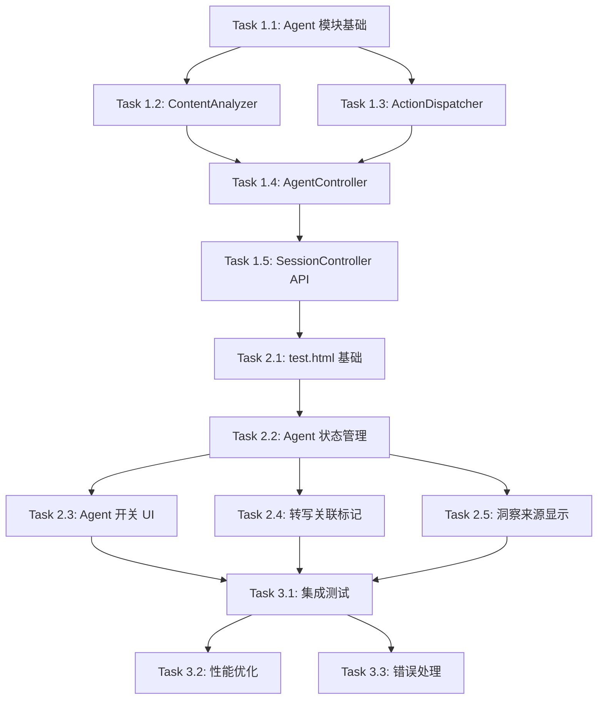

# 实施计划: 会议快照 V3 - Agent-Flow 智能联动系统

## 1. 任务概览

| 阶段 | 任务数 | 预估时间 | 依赖 |
|------|--------|---------|------|
| 后端 Agent 模块 | 5 | 1.5天 | 无 |
| 前端 test.html | 5 | 1.5天 | 阶段1 |
| 集成与测试 | 3 | 1天 | 阶段2 |

**总预估时间**: 4天

## 2. 文件变更概览

### 2.1 后端新增文件

```
backend/src/modules/agent/
├── agent.module.ts              # Agent 模块定义
├── agent.controller.ts          # Agent 控制器（启动/停止/循环）
├── content-analyzer.service.ts  # 内容分析器（检测逻辑）
├── action-dispatcher.service.ts # 动作分发器（调用现有功能）
└── types.ts                     # 类型定义
```

### 2.2 前端新增文件

```
demo_show/
├── index.html    # 不变 - 现有功能保持
└── test.html     # 新增 - Agent 联动测试页面
```

### 2.3 后端修改文件

```
backend/src/
├── app.module.ts                           # 注册 AgentModule
└── modules/session/session.controller.ts   # 新增 Agent 相关 API
```

## 3. 详细任务列表

---

### 阶段1: 后端 Agent 模块 (Day 1-2)

---

#### Task 1.1: 创建 Agent 模块基础结构

**目标**: 创建 Agent 模块的基础文件结构

**新增文件**:
```
backend/src/modules/agent/
├── agent.module.ts
└── types.ts
```

**types.ts 内容**:
```typescript
// 分析类型
export type AnalysisType = 
  | 'data_mention'      // 关键数据
  | 'off_topic'         // 跑题
  | 'redundancy'        // 冗余
  | 'decision_point';   // 决策时刻

// 分析结果
export interface AnalysisResult {
  type: AnalysisType;
  confidence: number;
  triggerSegmentIds: string[];
  context: string;
  metadata?: {
    matches?: string[];
    chartType?: string;
    reason?: string;
  };
}

// Agent 洞察
export interface AgentInsight {
  id: string;
  sessionId: string;
  type: 'data_chart' | 'focus_reminder' | 'redundancy_hint' | 'decision_record' | 'periodic_summary';
  triggerSegmentIds: string[];
  content: any;
  visualization?: {
    type: 'chart' | 'creative' | 'poster';
    imageUrl?: string;
    imageBase64?: string;
  };
  createdAt: Date;
  isAuto: true;
}
```

**agent.module.ts 内容**:
```typescript
import { Module } from '@nestjs/common';
import { AgentController } from './agent.controller';
import { ContentAnalyzerService } from './content-analyzer.service';
import { ActionDispatcherService } from './action-dispatcher.service';
import { ContextModule } from '../context/context.module';
import { SkillModule } from '../skill/skill.module';
import { VisualizationModule } from '../visualization/visualization.module';
import { LLMModule } from '../llm/llm.module';

@Module({
  imports: [ContextModule, SkillModule, VisualizationModule, LLMModule],
  providers: [AgentController, ContentAnalyzerService, ActionDispatcherService],
  exports: [AgentController],
})
export class AgentModule {}
```

**验收标准**:
- [ ] 模块文件创建完成
- [ ] 类型定义完整
- [ ] 模块可正常加载

---

#### Task 1.2: 实现 ContentAnalyzerService

**目标**: 实现内容分析器，检测数据、决策、跑题、冗余

**新增文件**:
```
backend/src/modules/agent/content-analyzer.service.ts
```

**核心实现**:

```typescript
@Injectable()
export class ContentAnalyzerService {
  private readonly cooldowns = new Map<string, number>();

  constructor(private readonly llmAdapter: LLMAdapterService) {}

  async analyze(sessionId: string, segments: ContextSegment[]): Promise<AnalysisResult[]> {
    const results: AnalysisResult[] = [];
    const text = segments.map(s => s.text).join('\n');

    // 1. 数据检测（正则 + 关键词）
    const dataResult = this.detectData(sessionId, segments, text);
    if (dataResult) results.push(dataResult);

    // 2. 决策检测（关键词）
    const decisionResult = this.detectDecision(sessionId, segments, text);
    if (decisionResult) results.push(decisionResult);

    // 3. LLM 检测（跑题 + 冗余）
    if (this.shouldRunLLMDetection(sessionId)) {
      const llmResults = await this.detectWithLLM(sessionId, segments, text);
      results.push(...llmResults);
    }

    return results;
  }

  // 数据检测 - 正则匹配
  private detectData(sessionId: string, segments: ContextSegment[], text: string): AnalysisResult | null {
    if (this.isInCooldown(sessionId, 'data_mention', 60000)) return null;

    const patterns = [
      /\d+(\.\d+)?%/g,                      // 百分比
      /\d{1,3}(,\d{3})*(\.\d+)?[万亿]?/g,   // 金额/数量
      /Q[1-4]|第[一二三四]季度/g,           // 季度
      /同比|环比|增长|下降|提升/g,          // 趋势词
    ];

    const matches: string[] = [];
    for (const pattern of patterns) {
      const found = text.match(pattern);
      if (found) matches.push(...found);
    }

    if (matches.length >= 2) {
      this.updateCooldown(sessionId, 'data_mention');
      return {
        type: 'data_mention',
        confidence: Math.min(0.6 + matches.length * 0.1, 1.0),
        triggerSegmentIds: segments.map(s => s.id),
        context: text,
        metadata: { matches, chartType: this.inferChartType(matches, text) },
      };
    }
    return null;
  }

  // 决策检测 - 关键词匹配
  private detectDecision(sessionId: string, segments: ContextSegment[], text: string): AnalysisResult | null {
    if (this.isInCooldown(sessionId, 'decision_point', 60000)) return null;

    const keywords = ['决定', '确定', '定了', '就这样', '达成共识', '同意', '通过', '敲定'];
    const matched = keywords.filter(kw => text.includes(kw));

    if (matched.length > 0) {
      this.updateCooldown(sessionId, 'decision_point');
      return {
        type: 'decision_point',
        confidence: Math.min(0.7 + matched.length * 0.1, 1.0),
        triggerSegmentIds: segments.map(s => s.id),
        context: text,
        metadata: { matches: matched },
      };
    }
    return null;
  }

  // LLM 检测 - 跑题和冗余
  private async detectWithLLM(sessionId: string, segments: ContextSegment[], text: string): Promise<AnalysisResult[]> {
    // ... LLM 调用逻辑
  }

  // 推断图表类型
  private inferChartType(matches: string[], text: string): string {
    if (text.includes('对比') || text.includes('比较')) return 'bar';
    if (text.includes('趋势') || text.includes('变化')) return 'line';
    if (matches.some(m => m.includes('%'))) return 'radar';
    return 'bar';
  }

  // 冷却时间管理
  private isInCooldown(sessionId: string, type: string, cooldownMs: number): boolean {
    const key = `${sessionId}-${type}`;
    const lastTrigger = this.cooldowns.get(key) || 0;
    return Date.now() - lastTrigger < cooldownMs;
  }

  private updateCooldown(sessionId: string, type: string): void {
    this.cooldowns.set(`${sessionId}-${type}`, Date.now());
  }
}
```

**验收标准**:
- [ ] 数据检测准确率 > 80%
- [ ] 决策检测准确率 > 75%
- [ ] 冷却机制正常工作
- [ ] 单元测试通过

---

#### Task 1.3: 实现 ActionDispatcherService

**目标**: 实现动作分发器，调用现有功能生成洞察

**新增文件**:
```
backend/src/modules/agent/action-dispatcher.service.ts
```

**核心实现（关键：复用现有服务）**:

```typescript
@Injectable()
export class ActionDispatcherService {
  constructor(
    private readonly skillService: SkillService,           // 复用现有技能服务
    private readonly visualizationService: VisualizationService,  // 复用现有视觉化服务
    private readonly contextStore: ContextStoreService,
    private readonly llmAdapter: LLMAdapterService,
  ) {}

  async dispatch(sessionId: string, result: AnalysisResult): Promise<AgentInsight | null> {
    switch (result.type) {
      case 'data_mention':
        return this.handleDataMention(sessionId, result);
      case 'off_topic':
        return this.handleOffTopic(sessionId, result);
      case 'redundancy':
        return this.handleRedundancy(sessionId, result);
      case 'decision_point':
        return this.handleDecision(sessionId, result);
      default:
        return null;
    }
  }

  // 处理数据 - 调用现有 VisualizationService
  private async handleDataMention(sessionId: string, result: AnalysisResult): Promise<AgentInsight> {
    const chartType = result.metadata?.chartType || 'bar';
    
    let visualization: AgentInsight['visualization'];
    try {
      // 关键：调用现有的视觉化服务
      const visResult = await this.visualizationService.generateVisualization({
        sessionId,
        type: 'chart',
        chartType: chartType as any,
      });
      visualization = {
        type: 'chart',
        imageUrl: visResult.imageUrl,
        imageBase64: visResult.imageBase64,
      };
    } catch (error) {
      // 图表生成失败，继续生成文字洞察
    }

    return {
      id: `agent-${Date.now()}`,
      sessionId,
      type: 'data_chart',
      triggerSegmentIds: result.triggerSegmentIds,
      content: { title: '📊 数据洞察', dataPoints: result.metadata?.matches },
      visualization,
      createdAt: new Date(),
      isAuto: true,
    };
  }

  // 处理跑题 - 调用现有 SkillService
  private async handleOffTopic(sessionId: string, result: AnalysisResult): Promise<AgentInsight> {
    // 关键：调用现有的聚焦技能
    const skillResult = await this.skillService.triggerSkill(sessionId, 'stop_talking');

    return {
      id: `agent-${Date.now()}`,
      sessionId,
      type: 'focus_reminder',
      triggerSegmentIds: result.triggerSegmentIds,
      content: { title: '🎯 聚焦提醒', ...skillResult.content },
      createdAt: new Date(),
      isAuto: true,
    };
  }

  // 周期性总结
  async dispatchPeriodicSummary(sessionId: string): Promise<AgentInsight | null> {
    const recentText = this.contextStore.getRecentText(sessionId, 1);
    if (!recentText || recentText.length < 50) return null;

    const summary = await this.llmAdapter.chatWithPrompt(
      '你是会议摘要专家。',
      `请用一句话（不超过50字）总结：\n\n${recentText}`
    );

    return {
      id: `agent-${Date.now()}`,
      sessionId,
      type: 'periodic_summary',
      triggerSegmentIds: [],
      content: { title: '📝 阶段小结', summary },
      createdAt: new Date(),
      isAuto: true,
    };
  }
}
```

**验收标准**:
- [ ] 成功调用 VisualizationService
- [ ] 成功调用 SkillService
- [ ] 洞察格式正确
- [ ] 集成测试通过

---

#### Task 1.4: 实现 AgentController

**目标**: 实现 Agent 控制器，管理 Agent 生命周期

**新增文件**:
```
backend/src/modules/agent/agent.controller.ts
```

**核心实现**:

```typescript
@Injectable()
export class AgentController {
  private readonly logger = new Logger(AgentController.name);
  private readonly sessions = new Map<string, {
    intervalId: NodeJS.Timeout;
    enabled: boolean;
    lastAnalyzedIndex: number;
    lastSummaryTime: number;
    insights: AgentInsight[];
  }>();

  constructor(
    private readonly contextStore: ContextStoreService,
    private readonly contentAnalyzer: ContentAnalyzerService,
    private readonly actionDispatcher: ActionDispatcherService,
  ) {}

  // 启动 Agent
  startAgent(sessionId: string): void {
    if (this.sessions.has(sessionId)) return;

    const intervalId = setInterval(async () => {
      await this.runAgentCycle(sessionId);
    }, 10000); // 每10秒

    this.sessions.set(sessionId, {
      intervalId,
      enabled: true,
      lastAnalyzedIndex: 0,
      lastSummaryTime: Date.now(),
      insights: [],
    });

    this.logger.log(`Agent started for session ${sessionId}`);
  }

  // 停止 Agent
  stopAgent(sessionId: string): void {
    const session = this.sessions.get(sessionId);
    if (session) {
      clearInterval(session.intervalId);
      this.sessions.delete(sessionId);
      this.logger.log(`Agent stopped for session ${sessionId}`);
    }
  }

  // 获取 Agent 状态
  getAgentStatus(sessionId: string): { enabled: boolean; insightCount: number } {
    const session = this.sessions.get(sessionId);
    return {
      enabled: session?.enabled ?? false,
      insightCount: session?.insights.length ?? 0,
    };
  }

  // 获取 Agent 洞察
  getAgentInsights(sessionId: string): AgentInsight[] {
    return this.sessions.get(sessionId)?.insights ?? [];
  }

  // Agent 主循环
  private async runAgentCycle(sessionId: string): Promise<void> {
    const session = this.sessions.get(sessionId);
    if (!session?.enabled) return;

    // 1. 获取新的转写内容
    const segments = this.contextStore.getSegments(sessionId);
    const newSegments = segments.slice(session.lastAnalyzedIndex);
    
    if (newSegments.length > 0) {
      // 2. 内容分析
      const results = await this.contentAnalyzer.analyze(sessionId, newSegments);

      // 3. 分发动作
      for (const result of results) {
        const insight = await this.actionDispatcher.dispatch(sessionId, result);
        if (insight) {
          session.insights.push(insight);
        }
      }

      session.lastAnalyzedIndex = segments.length;
    }

    // 4. 周期性总结（每30秒）
    const now = Date.now();
    if (now - session.lastSummaryTime >= 30000) {
      const summary = await this.actionDispatcher.dispatchPeriodicSummary(sessionId);
      if (summary) {
        session.insights.push(summary);
      }
      session.lastSummaryTime = now;
    }
  }
}
```

**验收标准**:
- [ ] Agent 可正常启动/停止
- [ ] 循环间隔准确（10秒）
- [ ] 周期性总结间隔准确（30秒）
- [ ] 洞察正确存储

---

#### Task 1.5: 扩展 SessionController API

**目标**: 在 SessionController 中添加 Agent 相关 API

**修改文件**:
```
backend/src/modules/session/session.controller.ts
```

**新增 API**:

```typescript
// 启动 Agent
@Post(':id/agent/start')
async startAgent(@Param('id') sessionId: string) {
  this.agentController.startAgent(sessionId);
  return { success: true, message: 'Agent started' };
}

// 停止 Agent
@Post(':id/agent/stop')
async stopAgent(@Param('id') sessionId: string) {
  this.agentController.stopAgent(sessionId);
  return { success: true, message: 'Agent stopped' };
}

// 获取 Agent 状态
@Get(':id/agent/status')
async getAgentStatus(@Param('id') sessionId: string) {
  return this.agentController.getAgentStatus(sessionId);
}

// 获取 Agent 洞察
@Get(':id/agent/insights')
async getAgentInsights(@Param('id') sessionId: string) {
  return { insights: this.agentController.getAgentInsights(sessionId) };
}
```

**验收标准**:
- [ ] API 正常响应
- [ ] 洞察数据正确返回
- [ ] API 测试通过

---

### 阶段2: 前端 test.html (Day 2-3)

---

#### Task 2.1: 创建 test.html 基础结构

**目标**: 复制 index.html 创建 test.html，保留所有现有功能

**新增文件**:
```
demo_show/test.html
```

**步骤**:
1. 复制 `demo_show/index.html` 为 `demo_show/test.html`
2. 修改页面标题为 "遇见会议 - Agent 联动测试"
3. 确保所有现有功能正常工作

**验收标准**:
- [ ] 文件创建成功
- [ ] 现有功能全部正常
- [ ] 样式与 index.html 一致

---

#### Task 2.2: 新增 Agent 状态管理

**目标**: 扩展前端 state 以支持 Agent 功能

**修改文件**:
```
demo_show/test.html
```

**新增状态**:

```javascript
const state = {
  // ... 现有状态保持不变
  
  // V3 新增
  agentEnabled: true,           // Agent 开关
  agentInsights: [],            // Agent 自动生成的洞察
  insightLinks: new Map(),      // segmentId -> insightId[] 关联映射
  segmentLinks: new Map(),      // insightId -> segmentId[] 反向映射
};
```

**新增函数**:

```javascript
// Agent 开关
async function toggleAgent() {
  state.agentEnabled = !state.agentEnabled;
  elements.agentToggle.classList.toggle('active', state.agentEnabled);

  if (state.sessionId) {
    try {
      if (state.agentEnabled) {
        await apiCall('POST', `/sessions/${state.sessionId}/agent/start`);
        startAgentPolling();
        showToast('🤖 Agent 已启动', 'success');
      } else {
        await apiCall('POST', `/sessions/${state.sessionId}/agent/stop`);
        stopAgentPolling();
        showToast('Agent 已停止', 'info');
      }
    } catch (error) {
      console.warn('Toggle agent failed:', error);
    }
  }
}

// Agent 洞察轮询
let agentPollingInterval = null;

function startAgentPolling() {
  if (agentPollingInterval) return;
  agentPollingInterval = setInterval(pollAgentInsights, 5000);
}

function stopAgentPolling() {
  if (agentPollingInterval) {
    clearInterval(agentPollingInterval);
    agentPollingInterval = null;
  }
}

async function pollAgentInsights() {
  if (!state.sessionId || !state.agentEnabled) return;

  try {
    const response = await apiCall('GET', `/sessions/${state.sessionId}/agent/insights`);
    const newInsights = response.insights.filter(
      i => !state.agentInsights.find(existing => existing.id === i.id)
    );

    if (newInsights.length > 0) {
      state.agentInsights = [...state.agentInsights, ...newInsights];
      
      // 更新关联映射
      newInsights.forEach(insight => {
        insight.triggerSegmentIds?.forEach(segId => {
          if (!state.insightLinks.has(segId)) {
            state.insightLinks.set(segId, []);
          }
          state.insightLinks.get(segId).push(insight.id);
        });
      });

      renderTranscription();  // 重新渲染以显示关联标记
      renderAgentInsights();  // 渲染 Agent 洞察
    }
  } catch (e) {
    console.warn('Poll agent insights failed:', e);
  }
}
```

**验收标准**:
- [ ] 状态管理正确
- [ ] 轮询正常工作
- [ ] 关联映射准确

---

#### Task 2.3: 新增 Agent 开关 UI

**目标**: 在 AI 技能区域添加 Agent 开关

**修改文件**:
```
demo_show/test.html
```

**HTML 变更**:

```html
<!-- 在 AI 技能区域的 auto-push-row 后面添加 -->
<div class="auto-push-row">
  <span class="auto-push-label">🤖 Agent 智能联动</span>
  <div class="toggle-switch active" id="agentToggle" onclick="toggleAgent()"></div>
</div>
<div class="agent-hint">自动检测数据/跑题，联动生成洞察</div>
```

**CSS 变更**:

```css
.agent-hint {
  font-size: 0.7rem;
  color: var(--text-muted);
  margin-top: 4px;
  padding-left: 4px;
}
```

**验收标准**:
- [ ] 开关显示正确
- [ ] 点击切换正常
- [ ] 样式美观

---

#### Task 2.4: 实现转写项关联标记

**目标**: 在有关联洞察的转写项上显示标记

**修改文件**:
```
demo_show/test.html
```

**修改 renderTranscription 函数**:

```javascript
function renderTranscription() {
  elements.transcriptCount.textContent = state.transcription.length;
  
  if (state.transcription.length === 0) {
    elements.transcriptionList.innerHTML = `
      <div class="empty-state" id="transcriptEmptyState">
        <div class="empty-state__icon">🎤</div>
        <p class="empty-state__text">开始录音后，转写内容将实时显示</p>
      </div>
    `;
    return;
  }
  
  const html = state.transcription.map(item => {
    const linkedInsights = state.insightLinks.get(item.id) || [];
    const hasLink = linkedInsights.length > 0;
    
    return `
      <div class="transcript-item ${hasLink ? 'has-insight' : ''}" 
           data-segment-id="${item.id}"
           ${hasLink ? `onclick="scrollToInsight('${linkedInsights[0]}')"` : ''}>
        <div class="transcript-time">${formatTime(item.startMs)}</div>
        <div class="transcript-text">${escapeHtml(item.text)}</div>
        ${hasLink ? `<div class="transcript-link-badge" title="点击查看相关洞察">💡</div>` : ''}
      </div>
    `;
  }).join('');
  
  elements.transcriptionList.innerHTML = html;
}
```

**新增 CSS**:

```css
/* 转写项关联标记 */
.transcript-item.has-insight {
  border-left: 3px solid var(--aurora-purple);
  cursor: pointer;
  position: relative;
}

.transcript-item.has-insight:hover {
  background: rgba(168, 85, 247, 0.1);
}

.transcript-link-badge {
  position: absolute;
  right: 12px;
  top: 50%;
  transform: translateY(-50%);
  font-size: 0.9rem;
  opacity: 0.7;
  transition: opacity 0.2s;
}

.transcript-item.has-insight:hover .transcript-link-badge {
  opacity: 1;
}
```

**验收标准**:
- [ ] 关联标记显示正确
- [ ] 点击跳转正常
- [ ] 样式美观

---

#### Task 2.5: 实现洞察卡片来源显示

**目标**: 在 Agent 洞察卡片上显示来源引用

**修改文件**:
```
demo_show/test.html
```

**新增 renderAgentInsights 函数**:

```javascript
function renderAgentInsights() {
  // 合并手动洞察和 Agent 洞察
  const allInsights = [...state.summaries, ...state.agentInsights];
  elements.insightCount.textContent = allInsights.length;
  
  if (allInsights.length === 0) {
    // 显示空状态
    return;
  }
  
  const html = allInsights.map(insight => {
    if (insight.isAuto) {
      return renderAutoInsightCard(insight);
    } else {
      return renderManualInsightCard(insight);
    }
  }).join('');
  
  elements.summaryList.innerHTML = html + '<div id="visualizationList"></div>';
}

function renderAutoInsightCard(insight) {
  const linkedText = insight.triggerSegmentIds
    ?.map(id => state.transcription.find(t => t.id === id)?.text)
    .filter(Boolean)
    .join(' ... ') || '';
  
  const typeIcons = {
    data_chart: '📊',
    focus_reminder: '🎯',
    redundancy_hint: '💬',
    decision_record: '✅',
    periodic_summary: '📝',
  };
  
  return `
    <article class="insight-card auto-insight" data-insight-id="${insight.id}">
      <header class="insight-card__header">
        <span class="insight-card__icon">${typeIcons[insight.type] || '✨'}</span>
        <h3 class="insight-card__title">${insight.content?.title || 'Agent 洞察'}</h3>
        <span class="insight-card__badge auto">自动</span>
        <time class="insight-card__time">${formatRelativeTime(insight.createdAt)}</time>
      </header>
      
      ${linkedText ? `
        <div class="insight-card__source" onclick="scrollToSegment('${insight.triggerSegmentIds[0]}')">
          <span class="source-label">📌 来源：</span>
          <span class="source-text">"${truncateText(linkedText, 50)}"</span>
        </div>
      ` : ''}
      
      <div class="insight-card__content">
        ${formatAgentInsightContent(insight)}
      </div>
      
      ${insight.visualization ? `
        <div class="insight-card__visualization">
          
        </div>
      ` : ''}
    </article>
  `;
}

function formatAgentInsightContent(insight) {
  const content = insight.content;
  if (!content) return '';
  
  let html = '';
  
  if (content.summary) {
    html += `<p>${escapeHtml(content.summary)}</p>`;
  }
  
  if (content.dataPoints?.length) {
    html += `<div class="data-points">检测到数据：${content.dataPoints.join(', ')}</div>`;
  }
  
  if (content.hint) {
    html += `<p>${escapeHtml(content.hint)}</p>`;
  }
  
  if (content.suggestion) {
    html += `<p class="suggestion">${escapeHtml(content.suggestion)}</p>`;
  }
  
  return html || JSON.stringify(content);
}

// 跳转函数
function scrollToSegment(segmentId) {
  const element = document.querySelector(`[data-segment-id="${segmentId}"]`);
  if (element) {
    element.scrollIntoView({ behavior: 'smooth', block: 'center' });
    element.classList.add('highlight-pulse');
    setTimeout(() => element.classList.remove('highlight-pulse'), 2000);
  }
}

function scrollToInsight(insightId) {
  const element = document.querySelector(`[data-insight-id="${insightId}"]`);
  if (element) {
    element.scrollIntoView({ behavior: 'smooth', block: 'center' });
    element.classList.add('highlight-pulse');
    setTimeout(() => element.classList.remove('highlight-pulse'), 2000);
  }
}
```

**新增 CSS**:

```css
/* 洞察来源引用 */
.insight-card__source {
  padding: 8px 12px;
  background: rgba(168, 85, 247, 0.1);
  border-radius: var(--radius-sm);
  margin-bottom: 12px;
  cursor: pointer;
  transition: all 0.2s;
}

.insight-card__source:hover {
  background: rgba(168, 85, 247, 0.2);
}

.source-label {
  font-size: 0.75rem;
  color: var(--aurora-purple);
  font-weight: 500;
}

.source-text {
  font-size: 0.8rem;
  color: var(--text-secondary);
  font-style: italic;
}

/* 自动洞察徽章 */
.insight-card__badge.auto {
  background: linear-gradient(135deg, var(--aurora-purple), var(--aurora-pink));
  color: white;
  font-size: 0.65rem;
  padding: 2px 8px;
  border-radius: var(--radius-full);
  margin-left: auto;
}

/* 新洞察入场动画 */
@keyframes insightSlideIn {
  from { opacity: 0; transform: translateX(20px); }
  to { opacity: 1; transform: translateX(0); }
}

.insight-card.auto-insight {
  animation: insightSlideIn 0.4s var(--ease-spring);
}

/* 高亮闪烁效果 */
@keyframes highlightPulse {
  0%, 100% { background: transparent; }
  50% { background: rgba(168, 85, 247, 0.2); }
}

.highlight-pulse {
  animation: highlightPulse 1s ease-in-out 2;
}

/* 数据点样式 */
.data-points {
  font-size: 0.8rem;
  color: var(--aurora-cyan);
  padding: 6px 10px;
  background: rgba(0, 212, 255, 0.1);
  border-radius: var(--radius-sm);
  margin: 8px 0;
}

.suggestion {
  font-size: 0.85rem;
  color: var(--color-success);
  font-style: italic;
}
```

**验收标准**:
- [ ] 来源引用显示正确
- [ ] 点击跳转正常
- [ ] 自动/手动标识清晰
- [ ] 动画效果流畅

---

### 阶段3: 集成与测试 (Day 4)

---

#### Task 3.1: 端到端集成测试

**目标**: 验证完整的 Agent 联动流程

**测试场景**:

| 场景 | 步骤 | 预期结果 |
|------|------|---------|
| 数据自动图表 | 1. 开始录音<br/>2. 说"Q3转化率是15%，比Q2提升了3%"<br/>3. 等待10秒 | 右侧自动出现数据洞察 + 图表 |
| 周期性总结 | 1. 开始录音<br/>2. 持续说话30秒 | 右侧自动出现阶段小结 |
| 关联跳转 | 1. 有自动洞察后<br/>2. 点击转写项的 💡<br/>3. 点击洞察的"来源" | 双向跳转正常 |
| Agent 开关 | 1. 关闭 Agent 开关<br/>2. 继续说话 | 不再自动生成洞察 |
| 手动功能 | 1. 关闭 Agent<br/>2. 点击"潜台词"按钮 | 手动功能正常工作 |

**验收标准**:
- [ ] 所有场景测试通过
- [ ] 无明显 Bug
- [ ] 性能符合要求

---

#### Task 3.2: 性能优化

**目标**: 优化 Agent 性能

**优化点**:

| 优化项 | 方式 |
|-------|------|
| 检测逻辑 | 先规则后 LLM，减少 LLM 调用 |
| 冷却机制 | 避免同类型洞察频繁触发 |
| 前端渲染 | 增量更新，只渲染新洞察 |
| 轮询优化 | 使用 WebSocket 替代轮询（可选） |

**验收标准**:
- [ ] 检测延迟 < 3秒
- [ ] 洞察生成延迟 < 5秒
- [ ] 前端渲染延迟 < 100ms

---

#### Task 3.3: 错误处理与降级

**目标**: 完善错误处理和降级机制

**处理场景**:

| 场景 | 处理方式 |
|------|---------|
| LLM 不可用 | 降级为纯规则检测 |
| 图表生成失败 | 只显示文字洞察 |
| Agent 异常 | 自动停止，不影响手动功能 |
| 网络超时 | 重试机制 |

**验收标准**:
- [ ] 降级机制生效
- [ ] 错误提示友好
- [ ] 不影响主流程

---

## 4. 依赖关系图



## 5. 验收检查清单

### 功能验收

- [ ] Agent 可正常启动/停止
- [ ] 数据检测并自动生成图表
- [ ] 30秒周期性总结
- [ ] 转写-洞察双向关联
- [ ] Agent 开关独立于自动推送
- [ ] 手动技能不受影响
- [ ] 视觉化功能不受影响

### 性能验收

- [ ] Agent 循环间隔 10秒
- [ ] 检测延迟 < 3秒
- [ ] 洞察生成延迟 < 5秒
- [ ] 图表生成延迟 < 15秒
- [ ] 前端渲染延迟 < 100ms

### 兼容性验收

- [ ] index.html 功能正常（不变）
- [ ] test.html 现有功能正常
- [ ] test.html Agent 功能正常

---

## 6. 风险与缓解

| 风险 | 概率 | 影响 | 缓解措施 |
|------|------|------|---------| 
| LLM 响应延迟 | 中 | 高 | 优先规则检测，LLM 设置超时 |
| 检测误报率高 | 中 | 中 | 调整置信度阈值，增加冷却时间 |
| 与现有功能冲突 | 低 | 高 | 充分测试，保持模块独立 |
| 前端性能问题 | 低 | 中 | 增量渲染，限制洞察数量 |

---

**请确认以上实施计划，确认后可以开始开发。**
