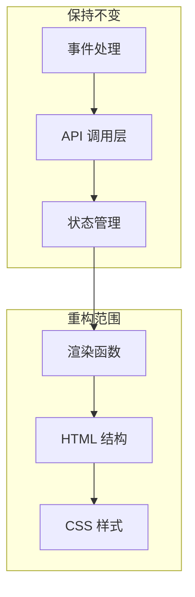

# 技术方案设计 - 会议快照前端重构 v2

## 1. 架构概述

本次重构采用**纯前端重构**策略，仅修改 HTML/CSS/JS 的 UI 层，完全保留现有的：
- API 调用逻辑（`apiCall` 函数）
- 状态管理（`state` 对象）
- 事件处理函数（录制、技能触发、问答等）
- WebSocket/轮询机制



## 2. 视觉设计系统

### 2.1 配色方案 - "Aurora 极光"主题

设计理念：深邃的夜空 + 流动的极光色彩，体现 AI 的智能与科技感

```css
:root {
  /* 深邃夜空背景 */
  --bg-deep: #0a0e1a;
  --bg-primary: #0f1629;
  --bg-secondary: #151d35;
  --bg-card: rgba(22, 32, 60, 0.6);
  --bg-glass: rgba(255, 255, 255, 0.03);
  
  /* 文字色 - 冷白 */
  --text-primary: #f0f4ff;
  --text-secondary: #8b9cc7;
  --text-muted: #4a5578;
  
  /* 极光色彩系统 */
  --aurora-cyan: #00d4ff;      /* 主强调 - 电光蓝 */
  --aurora-mint: #00ffc8;      /* 成功色 - 薄荷绿 */
  --aurora-purple: #a855f7;    /* 次强调 - 紫罗兰 */
  --aurora-pink: #ff6b9d;      /* 警告色 - 珊瑚粉 */
  --aurora-blue: #3b82f6;      /* 信息色 - 天蓝 */
  
  /* 功能色 */
  --color-recording: #ff4d6a;
  --color-success: #00ffc8;
  --color-warning: #fbbf24;
  --color-info: #00d4ff;
  --color-error: #ff4d6a;
  
  /* 高亮 - 发光效果 */
  --highlight-glow: rgba(0, 212, 255, 0.15);
  --highlight-text: #00d4ff;
  
  /* 边框 - 微妙玻璃感 */
  --border-subtle: rgba(255, 255, 255, 0.06);
  --border-glow: rgba(0, 212, 255, 0.3);
}
```

### 2.2 字体系统

```css
/* 标题字体 - Space Grotesk (几何现代感) */
/* 正文字体 - Outfit (清晰易读) */
@import url('https://fonts.googleapis.com/css2?family=Space+Grotesk:wght@400;500;600;700&family=Outfit:wght@300;400;500;600&display=swap');

:root {
  --font-display: 'Space Grotesk', system-ui, sans-serif;
  --font-body: 'Outfit', system-ui, sans-serif;
  --font-mono: 'JetBrains Mono', monospace;
}
```

### 2.3 动画系统

```css
:root {
  --ease-out: cubic-bezier(0.4, 0, 0.2, 1);
  --ease-in-out: cubic-bezier(0.4, 0, 0.2, 1);
  --duration-fast: 150ms;
  --duration-normal: 250ms;
  --duration-slow: 400ms;
}
```

## 3. 布局架构

### 3.1 整体布局结构

```
┌─────────────────────────────────────────────────────────────┐
│  顶部导航栏 (固定)                                           │
├─────────────────────────────────────────────────────────────┤
│  录制控制栏 (紧凑型, 高度 72px)                              │
│  ┌─────────┬────────────────────────────────┬────────────┐  │
│  │ ● 状态  │  00:00  ▶️ 暂停  ⏹️ 停止        │  📁 上传   │  │
│  └─────────┴────────────────────────────────┴────────────┘  │
├─────────────────────────────────────────────────────────────┤
│  主内容区 (flex-grow)                                        │
│  ┌──────────────────────┬───────────────────┬────────────┐  │
│  │                      │                   │            │  │
│  │     实时转写         │    会议洞察       │   工具栏   │  │
│  │     (flex: 1)        │    (flex: 1)      │  (280px)   │  │
│  │                      │                   │            │  │
│  │                      │                   │  AI 技能   │  │
│  │                      │                   │  视觉化    │  │
│  │                      │                   │  问答      │  │
│  │                      │                   │            │  │
│  └──────────────────────┴───────────────────┴────────────┘  │
└─────────────────────────────────────────────────────────────┘
```

### 3.2 响应式断点

```css
/* 大屏 - 三栏布局 */
@media (min-width: 1400px) {
  .main-content { grid-template-columns: 1fr 1fr 280px; }
}

/* 中屏 - 双栏 + 浮动工具栏 */
@media (min-width: 1024px) and (max-width: 1399px) {
  .main-content { grid-template-columns: 1fr 1fr; }
  .toolbar { position: fixed; right: 16px; bottom: 16px; }
}

/* 小屏 - 单栏 + 底部 Tab */
@media (max-width: 1023px) {
  .main-content { grid-template-columns: 1fr; }
  .mobile-tabs { display: flex; }
}
```

## 4. 组件设计

### 4.1 录制控制栏组件

```html
<div class="recording-bar">
  <div class="recording-bar__status">
    <span class="status-dot" data-state="idle"></span>
    <span class="status-text">准备就绪</span>
  </div>
  
  <div class="recording-bar__timer">
    <span class="timer-display">00:00</span>
    <div class="waveform-mini"></div>
  </div>
  
  <div class="recording-bar__controls">
    <button class="btn-record" aria-label="开始录音">
      <svg>...</svg>
    </button>
    <button class="btn-pause" disabled aria-label="暂停">
      <svg>...</svg>
    </button>
  </div>
  
  <div class="recording-bar__upload">
    <input type="file" id="uploadInput" hidden accept="audio/*">
    <button class="btn-upload" aria-label="上传文件">
      <svg>...</svg>
    </button>
  </div>
</div>
```

### 4.2 洞察卡片组件

```html
<article class="insight-card" data-type="inner_os">
  <header class="insight-card__header">
    <span class="insight-card__icon">🧠</span>
    <h3 class="insight-card__title">内心 OS</h3>
    <time class="insight-card__time">14:32</time>
  </header>
  
  <div class="insight-card__content">
    <p>当讨论到预算分配时，<mark class="highlight">财务总监的沉默</mark>可能暗示...</p>
    <blockquote class="insight-card__quote">
      "这个方案需要更多资源支持"
    </blockquote>
  </div>
</article>
```

### 4.3 卡片类型样式映射

| 类型 | 中文标题 | 图标 | 边框色 | 特殊样式 |
|------|----------|------|--------|----------|
| inner_os | 内心 OS | 🧠 | 靛蓝 | 引用样式 |
| brainstorm | 头脑风暴 | 💡 | 琥珀 | 编号列表 |
| stop_talking | 纠偏提醒 | ⚠️ | 橙红 | 警告边框 |
| auto_analysis | 自动分析 | 📊 | 青绿 | 标准样式 |

## 5. 关键渲染函数改造

### 5.1 renderSummaries 改造

```javascript
// 类型映射
const INSIGHT_TYPES = {
  inner_os: { title: '内心 OS', icon: '🧠', color: 'var(--color-info)' },
  brainstorm: { title: '头脑风暴', icon: '💡', color: 'var(--accent-amber)' },
  stop_talking: { title: '纠偏提醒', icon: '⚠️', color: 'var(--color-warning)' },
  auto_analysis: { title: '自动分析', icon: '📊', color: 'var(--color-success)' }
};

function renderSummaries() {
  const html = state.summaries.map(card => {
    const typeInfo = INSIGHT_TYPES[card.type] || INSIGHT_TYPES.auto_analysis;
    const content = formatInsightContent(card.content, card.type);
    
    return `
      <article class="insight-card" data-type="${card.type}">
        <header class="insight-card__header">
          <span class="insight-card__icon">${typeInfo.icon}</span>
          <h3 class="insight-card__title">${typeInfo.title}</h3>
          <time class="insight-card__time">${formatTime(Date.now())}</time>
        </header>
        <div class="insight-card__content">${content}</div>
      </article>
    `;
  }).join('');
  
  elements.insightList.innerHTML = html;
}

function formatInsightContent(content, type) {
  // 处理高亮关键词
  let html = highlightKeywords(content);
  
  // 根据类型添加特殊格式
  if (type === 'inner_os') {
    html = wrapQuotes(html);
  } else if (type === 'brainstorm') {
    html = formatAsList(html);
  }
  
  return html;
}

function highlightKeywords(text) {
  // 高亮关键词模式：【关键词】或 **关键词**
  return text
    .replace(/【(.+?)】/g, '<mark class="highlight">$1</mark>')
    .replace(/\*\*(.+?)\*\*/g, '<mark class="highlight">$1</mark>');
}
```

## 6. 文件结构

由于是单文件 HTML，所有代码将保持在 `demo_show/index.html` 中，但逻辑上分为：

```
demo_show/index.html
├── <head>
│   ├── Meta & Fonts
│   └── <style> (完全重写)
├── <body>
│   ├── 导航栏 (简化)
│   ├── 录制控制栏 (新增)
│   ├── 主内容区 (重构)
│   │   ├── 实时转写面板
│   │   ├── 会议洞察面板
│   │   └── 工具栏
│   └── Toast 容器
└── <script>
    ├── State (保持不变)
    ├── API Functions (保持不变)
    ├── Recording Functions (保持不变)
    ├── Skill Functions (保持不变)
    ├── Render Functions (修改)
    └── UI Update Functions (修改)
```

## 7. 不变部分清单

以下代码/逻辑**必须保持不变**：

1. `state` 对象结构
2. `apiCall()` 函数
3. `testConnection()` 函数
4. `startRecording()` / `stopRecording()` 函数
5. `togglePause()` 函数
6. `triggerSkill()` 函数
7. `toggleAutoPush()` 函数
8. `uploadAndTranscribe()` 函数
9. `askQuestion()` 函数
10. `pollUpdates()` 函数
11. `generateVisualization()` 函数
12. 所有 API 路径和请求格式

## 8. 测试策略

### 8.1 功能验证

| 功能 | 验证方法 |
|------|----------|
| 后端连接 | 页面加载后自动测试，状态指示器正确显示 |
| 录音功能 | 点击录音按钮，验证计时器、波形、状态变化 |
| 实时转写 | 录音过程中，左侧面板实时更新转写内容 |
| AI 技能 | 点击技能按钮，右侧面板显示洞察卡片 |
| 文件上传 | 上传音频文件，验证转写流程 |
| 问答功能 | 输入问题，验证回复显示 |
| 视觉化 | 生成视觉化内容，验证图片显示 |

### 8.2 视觉验证

- [ ] 配色符合"墨纸"主题
- [ ] 字体正确加载（思源宋体/黑体）
- [ ] 动画流畅，无卡顿
- [ ] 响应式布局在各断点正确切换
- [ ] 高亮效果清晰可见

## 9. 安全性

本次重构不涉及：
- 后端 API 修改
- 数据存储逻辑
- 认证/授权机制
- 敏感信息处理

所有安全相关逻辑保持现有实现不变。
