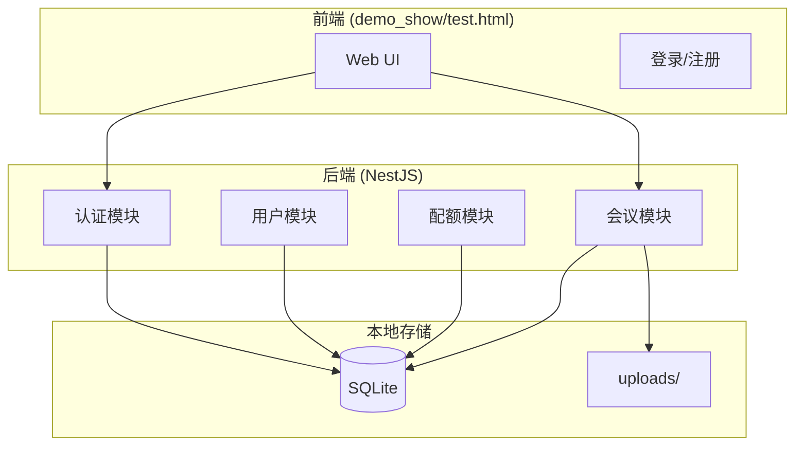
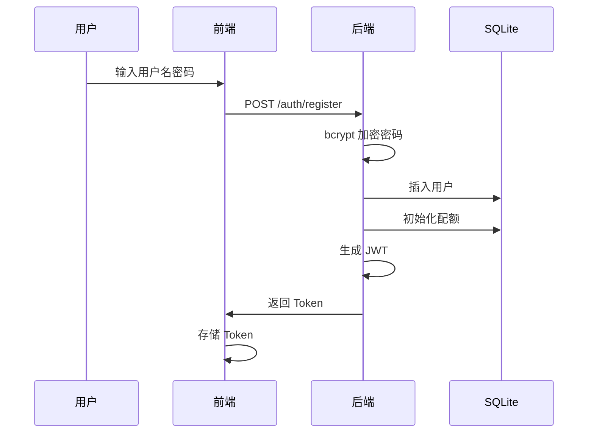
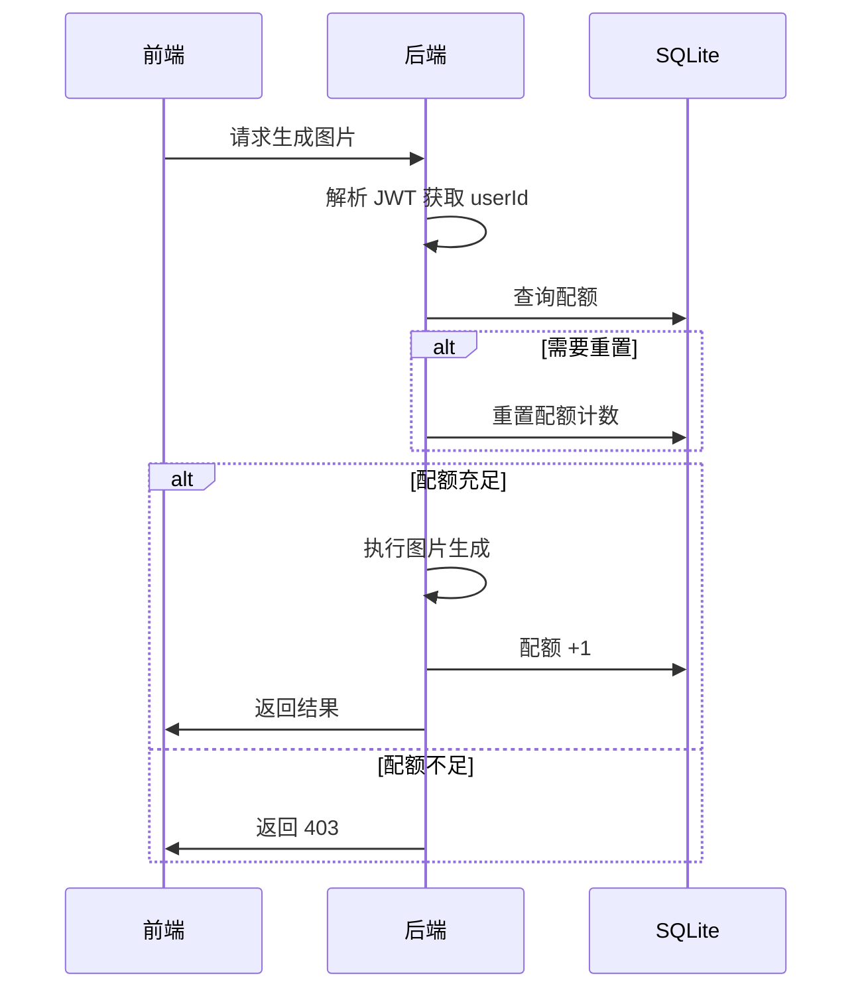

# 技术方案设计: 内测版用户系统

## 1. 系统架构（极简版）



## 2. 技术栈

| 层级 | 技术 | 说明 |
|------|------|------|
| 数据库 | SQLite + better-sqlite3 | 无需安装，零配置 |
| ORM | 直接 SQL 或 Knex.js | 轻量级 |
| 认证 | JWT + bcrypt | 简单安全 |
| 文件存储 | 本地文件系统 | uploads/ 目录 |

## 3. 数据库设计

### 3.1 表结构

```sql
-- 用户表
CREATE TABLE users (
    id INTEGER PRIMARY KEY AUTOINCREMENT,
    username TEXT UNIQUE NOT NULL,
    password_hash TEXT NOT NULL,
    created_at DATETIME DEFAULT CURRENT_TIMESTAMP
);

-- 配额表
CREATE TABLE quotas (
    id INTEGER PRIMARY KEY AUTOINCREMENT,
    user_id INTEGER UNIQUE REFERENCES users(id),
    daily_insight_used INTEGER DEFAULT 0,
    daily_qa_used INTEGER DEFAULT 0,
    monthly_image_used INTEGER DEFAULT 0,
    daily_reset_at DATETIME,
    monthly_reset_at DATETIME
);

-- 会议表
CREATE TABLE meetings (
    id INTEGER PRIMARY KEY AUTOINCREMENT,
    user_id INTEGER REFERENCES users(id),
    session_id TEXT UNIQUE NOT NULL,
    title TEXT,
    duration_ms INTEGER DEFAULT 0,
    status TEXT DEFAULT 'active',
    created_at DATETIME DEFAULT CURRENT_TIMESTAMP
);

-- 转写记录表
CREATE TABLE transcripts (
    id INTEGER PRIMARY KEY AUTOINCREMENT,
    meeting_id INTEGER REFERENCES meetings(id),
    start_ms INTEGER,
    end_ms INTEGER,
    content TEXT,
    created_at DATETIME DEFAULT CURRENT_TIMESTAMP
);

-- 洞察记录表
CREATE TABLE insights (
    id INTEGER PRIMARY KEY AUTOINCREMENT,
    meeting_id INTEGER REFERENCES meetings(id),
    type TEXT NOT NULL,
    content TEXT,
    created_at DATETIME DEFAULT CURRENT_TIMESTAMP
);

-- 可视化记录表
CREATE TABLE visualizations (
    id INTEGER PRIMARY KEY AUTOINCREMENT,
    meeting_id INTEGER REFERENCES meetings(id),
    type TEXT NOT NULL,
    image_path TEXT,
    prompt TEXT,
    created_at DATETIME DEFAULT CURRENT_TIMESTAMP
);

-- 索引
CREATE INDEX idx_meetings_user ON meetings(user_id);
CREATE INDEX idx_transcripts_meeting ON transcripts(meeting_id);
```

## 4. 接口设计

### 4.1 认证接口

```yaml
# 注册
POST /api/auth/register
Request:
  username: string
  password: string
Response:
  user: { id, username }
  token: string

# 登录
POST /api/auth/login
Request:
  username: string
  password: string
Response:
  user: { id, username }
  token: string
```

### 4.2 用户接口

```yaml
# 获取当前用户信息
GET /api/users/me
Headers: Authorization: Bearer <token>
Response:
  user: { id, username }
  quota: { dailyInsight, dailyQa, monthlyImage }

# 获取会议列表
GET /api/users/me/meetings
Response:
  meetings: [{ id, title, duration, createdAt }]
```

### 4.3 配额接口（内部）

```yaml
# 检查配额
GET /api/quota/check?type=insight|image|qa
Response:
  allowed: boolean
  remaining: number

# 消耗配额（内部调用）
POST /api/quota/consume
Request:
  type: 'insight' | 'image' | 'qa'
Response:
  success: boolean
```

## 5. 文件存储

```
backend/
├── data/
│   └── meetmind.db          # SQLite 数据库文件
└── uploads/
    └── {meetingId}/
        └── {visId}.png      # 生成的图片
```

## 6. 认证流程



## 7. 配额检查流程



## 8. 现有模块改造

### 8.1 需要新增的模块

| 模块 | 文件 | 功能 |
|------|------|------|
| DatabaseModule | `database/` | SQLite 连接管理 |
| AuthModule | `auth/` | 注册、登录、JWT |
| UserModule | `user/` | 用户信息 |
| QuotaModule | `quota/` | 配额管理 |

### 8.2 需要改造的模块

| 模块 | 改造内容 |
|------|----------|
| SessionService | 关联用户、保存到数据库 |
| SkillService | 添加配额检查 |
| VisualizationService | 添加配额检查、保存图片到本地 |
| ContextStoreService | 同步保存到数据库 |
