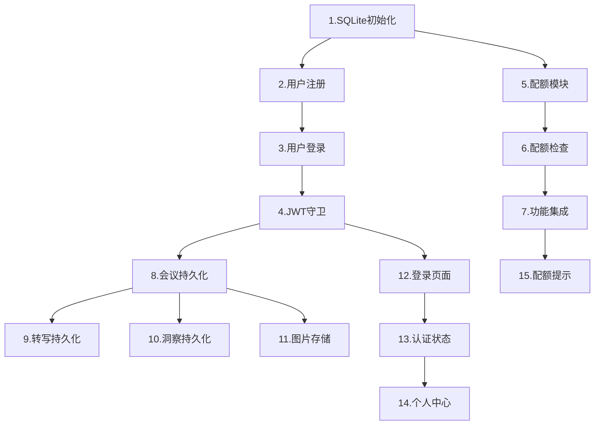

# 实施计划: 内测版用户系统

## 阶段一：数据库与认证 (Day 1)

- [x] 1. SQLite 数据库初始化
  - 安装 better-sqlite3 依赖
  - 创建 DatabaseModule
  - 初始化表结构
  - 需求: 需求2

- [x] 2. 用户注册功能
  - 创建 AuthModule
  - 安装 bcrypt, jsonwebtoken
  - 实现 POST /auth/register
  - 密码加密存储
  - 自动初始化配额
  - 需求: 需求1

- [x] 3. 用户登录功能
  - 实现 POST /auth/login
  - 密码验证
  - JWT Token 生成
  - 需求: 需求1

- [x] 4. JWT 认证守卫
  - 创建 AuthGuard
  - Token 解析和验证
  - 需求: 需求1

---

## 阶段二：配额系统 (Day 1)

- [x] 5. 配额模块基础
  - 创建 QuotaModule 和 QuotaService
  - 实现配额查询
  - 需求: 需求3

- [x] 6. 配额检查与扣减
  - 实现 checkQuota(userId, type)
  - 实现 consumeQuota(userId, type)
  - 自动重置逻辑（每日/每月）
  - 需求: 需求3

- [x] 7. 现有功能配额集成
  - SkillService 添加配额检查
  - VisualizationService 添加配额检查
  - SessionService.askQuestion 添加配额检查
  - 需求: 需求3

---

## 阶段三：数据持久化 (Day 2)

- [x] 8. 会议数据持久化
  - 修改 SessionService 创建会议时写入数据库
  - 关联会议到当前登录用户
  - 需求: 需求2

- [x] 9. 转写内容持久化
  - 修改 ContextStoreService 同步写入数据库
  - 批量插入优化
  - 需求: 需求2

- [x] 10. 洞察内容持久化
  - 修改 SkillService 保存结果到数据库
  - 需求: 需求2

- [x] 11. 图片本地存储
  - 创建 uploads/ 目录
  - 修改 VisualizationService 保存图片到本地
  - 数据库记录图片路径
  - 需求: 需求2

---

## 阶段四：前端改造 (Day 2-3)

- [x] 12. 登录注册页面
  - 创建登录/注册 UI
  - 表单验证
  - 调用认证接口
  - 需求: 需求1

- [x] 13. 认证状态管理
  - Token 存储到 localStorage
  - 请求拦截器添加 Authorization 头
  - 未登录跳转登录页
  - 需求: 需求1

- [x] 14. 个人中心页面
  - 显示用户名和配额状态
  - 会议历史列表
  - 需求: 需求4

- [x] 15. 配额提示
  - 配额不足时显示提示
  - 显示剩余配额
  - 需求: 需求3

---

## 任务依赖关系

---

## 里程碑计划

| 里程碑 | 任务 | 时间 | 目标 |
|--------|------|------|------|
| M1 | 1-7 | Day 1 | 用户可注册登录，配额生效 |
| M2 | 8-11 | Day 2 | 数据持久化完成 |
| M3 | 12-15 | Day 2-3 | 前端改造完成 |

**总计：约 3 个工作日**

---

## 附录：配额限制

| 功能 | 限制 | 重置周期 |
|------|------|----------|
| AI 洞察 | 50次/日 | 每日 0 点 |
| 会议问答 | 100次/日 | 每日 0 点 |
| 图片生成 | 5次/月 | 每月 1 日 |
| 语音转录 | 无限制 | - |

---

## 附录：现有模块改造清单

| 模块 | 改造内容 | 任务 |
|------|----------|------|
| SessionService | 关联用户、数据库存储 | 8 |
| ContextStoreService | 数据库持久化 | 9 |
| SkillService | 配额检查、结果持久化 | 7, 10 |
| VisualizationService | 配额检查、本地存储 | 7, 11 |
