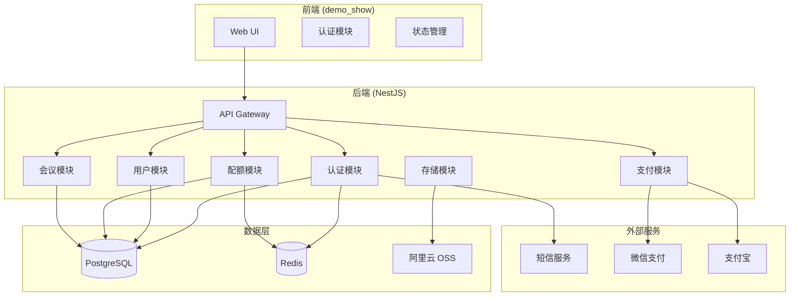
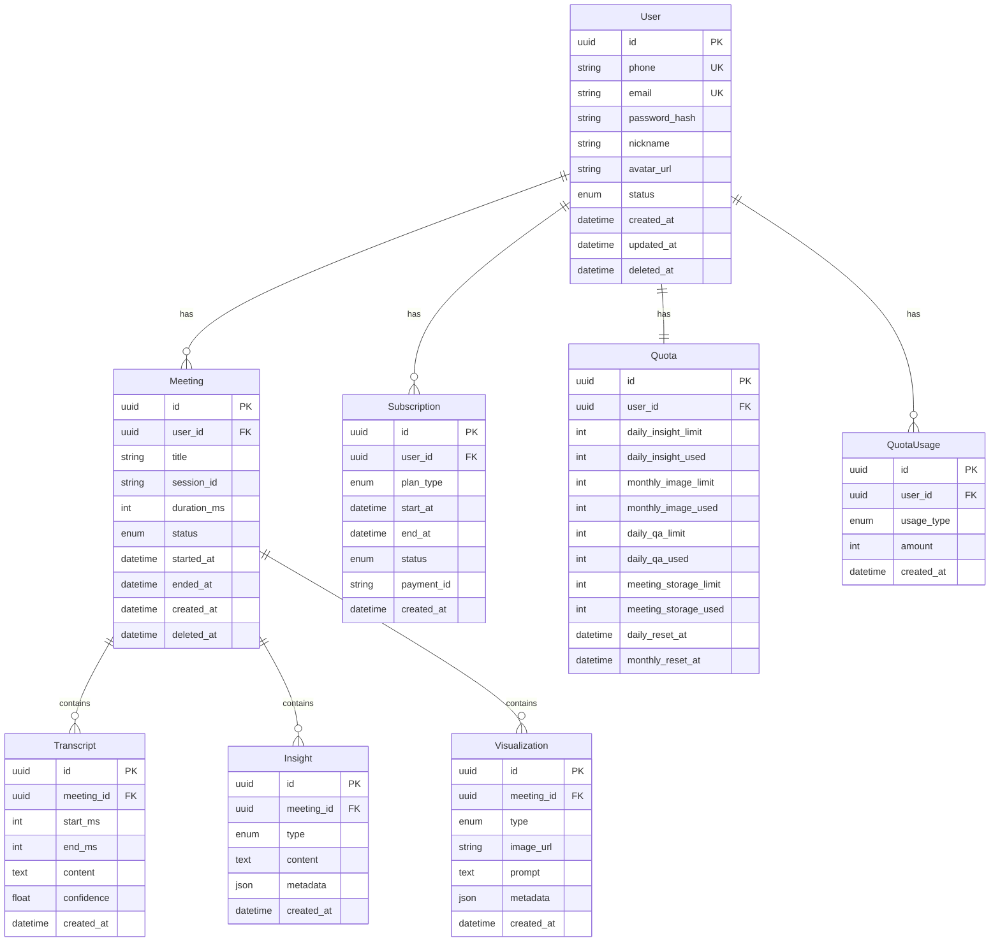
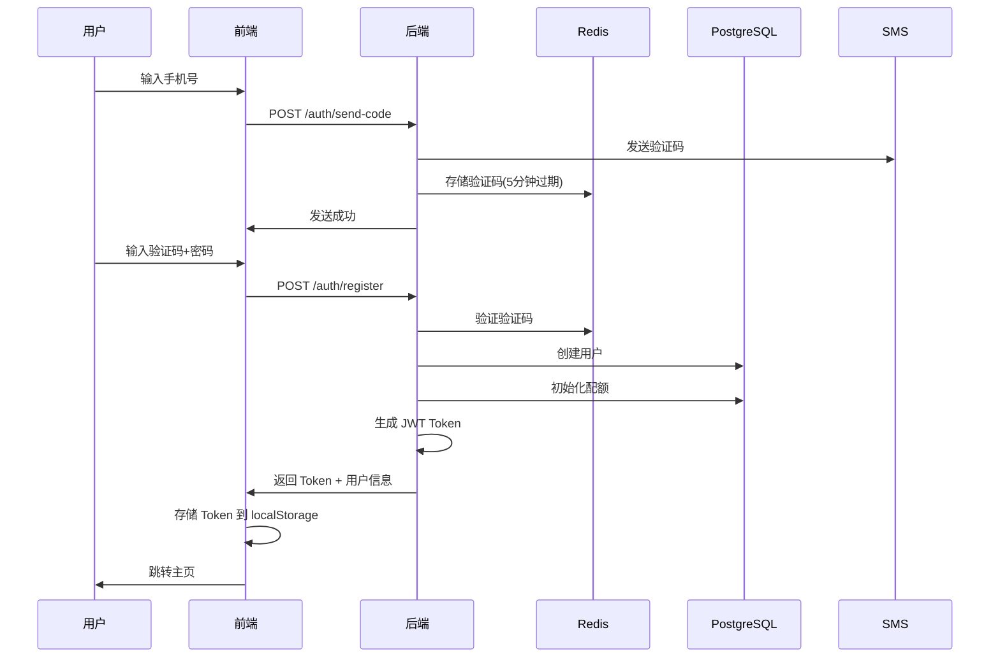
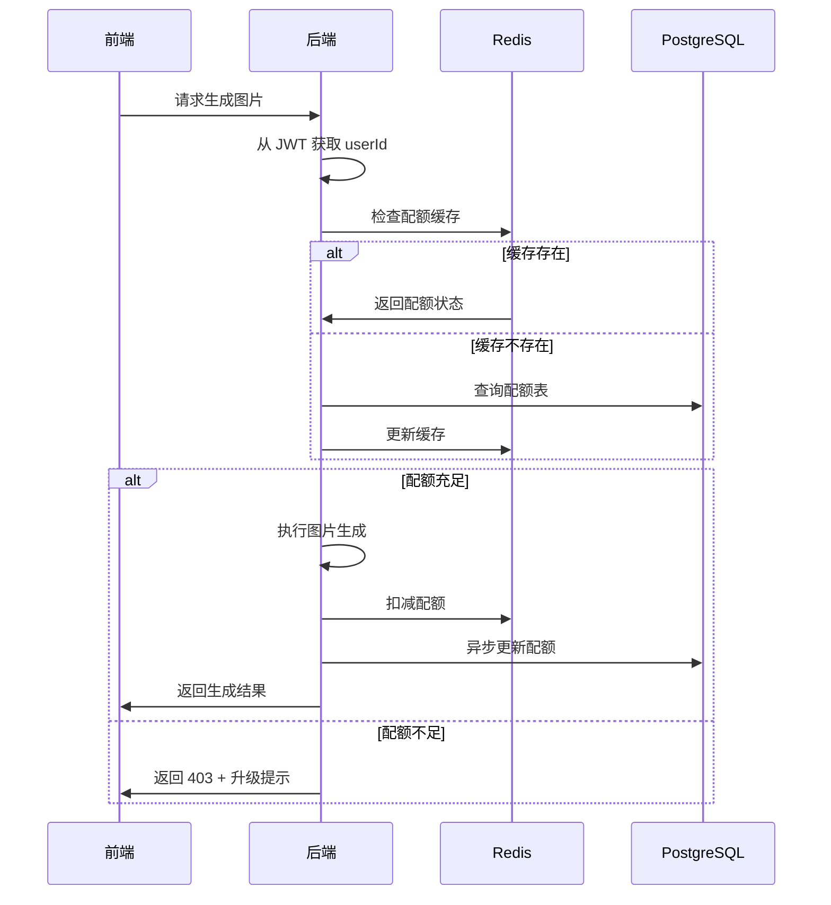
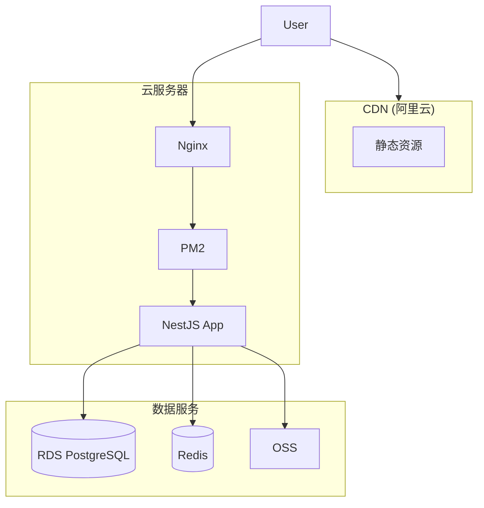

# 技术方案设计: 用户管理与平台商业化系统

## 1. 系统架构



## 2. 技术栈

| 层级 | 技术选型 | 说明 |
|------|----------|------|
| 前端 | HTML/CSS/JS | 现有 demo_show，添加认证逻辑 |
| 后端 | NestJS + TypeScript | 现有架构，新增模块 |
| 数据库 | PostgreSQL | 关系型数据，ACID 保证 |
| 缓存 | Redis | Session、配额计数、Token 黑名单 |
| 对象存储 | 阿里云 OSS | 图片、音频文件存储 |
| ORM | Prisma | 类型安全，迁移管理 |
| 认证 | JWT + Passport | 无状态认证 |
| 支付 | 微信支付/支付宝 SDK | 订阅付费 |

## 3. 数据库设计

### 3.1 ER 图



### 3.2 核心表结构

```sql
-- 用户表
CREATE TABLE users (
    id UUID PRIMARY KEY DEFAULT gen_random_uuid(),
    phone VARCHAR(20) UNIQUE,
    email VARCHAR(255) UNIQUE,
    password_hash VARCHAR(255),
    nickname VARCHAR(50),
    avatar_url VARCHAR(500),
    status VARCHAR(20) DEFAULT 'active', -- active, locked, deleted
    created_at TIMESTAMP DEFAULT NOW(),
    updated_at TIMESTAMP DEFAULT NOW(),
    deleted_at TIMESTAMP
);

-- 订阅表
CREATE TABLE subscriptions (
    id UUID PRIMARY KEY DEFAULT gen_random_uuid(),
    user_id UUID REFERENCES users(id),
    plan_type VARCHAR(20) NOT NULL, -- monthly, quarterly, yearly
    start_at TIMESTAMP NOT NULL,
    end_at TIMESTAMP NOT NULL,
    status VARCHAR(20) DEFAULT 'active', -- active, expired, cancelled
    payment_id VARCHAR(100),
    amount_cents INT,
    created_at TIMESTAMP DEFAULT NOW()
);

-- 配额表
CREATE TABLE quotas (
    id UUID PRIMARY KEY DEFAULT gen_random_uuid(),
    user_id UUID UNIQUE REFERENCES users(id),
    daily_insight_limit INT DEFAULT 20,
    daily_insight_used INT DEFAULT 0,
    monthly_image_limit INT DEFAULT 5,
    monthly_image_used INT DEFAULT 0,
    daily_qa_limit INT DEFAULT 50,
    daily_qa_used INT DEFAULT 0,
    meeting_storage_limit INT DEFAULT 10,
    meeting_storage_used INT DEFAULT 0,
    daily_reset_at TIMESTAMP,
    monthly_reset_at TIMESTAMP,
    updated_at TIMESTAMP DEFAULT NOW()
);

-- 会议表
CREATE TABLE meetings (
    id UUID PRIMARY KEY DEFAULT gen_random_uuid(),
    user_id UUID REFERENCES users(id),
    title VARCHAR(200),
    session_id VARCHAR(100) UNIQUE,
    duration_ms INT DEFAULT 0,
    status VARCHAR(20) DEFAULT 'active', -- active, ended, deleted
    started_at TIMESTAMP,
    ended_at TIMESTAMP,
    created_at TIMESTAMP DEFAULT NOW(),
    deleted_at TIMESTAMP
);

-- 转写记录表
CREATE TABLE transcripts (
    id UUID PRIMARY KEY DEFAULT gen_random_uuid(),
    meeting_id UUID REFERENCES meetings(id),
    start_ms INT,
    end_ms INT,
    content TEXT,
    confidence FLOAT,
    created_at TIMESTAMP DEFAULT NOW()
);

-- 洞察记录表
CREATE TABLE insights (
    id UUID PRIMARY KEY DEFAULT gen_random_uuid(),
    meeting_id UUID REFERENCES meetings(id),
    type VARCHAR(50) NOT NULL, -- inner_os, brainstorm, stop_talking
    content TEXT,
    metadata JSONB,
    created_at TIMESTAMP DEFAULT NOW()
);

-- 可视化记录表
CREATE TABLE visualizations (
    id UUID PRIMARY KEY DEFAULT gen_random_uuid(),
    meeting_id UUID REFERENCES meetings(id),
    type VARCHAR(50) NOT NULL, -- chart, creative, poster
    chart_type VARCHAR(50), -- radar, flowchart, architecture, bar, line (仅 chart 类型)
    image_url VARCHAR(500),
    prompt TEXT,
    metadata JSONB,
    created_at TIMESTAMP DEFAULT NOW()
);

-- 索引
CREATE INDEX idx_meetings_user_id ON meetings(user_id);
CREATE INDEX idx_transcripts_meeting_id ON transcripts(meeting_id);
CREATE INDEX idx_insights_meeting_id ON insights(meeting_id);
CREATE INDEX idx_subscriptions_user_id ON subscriptions(user_id);
```

## 4. 接口设计

### 4.1 认证接口

```yaml
# 注册
POST /api/auth/register
Request:
  phone: string (可选)
  email: string (可选)
  password: string
  code: string (验证码，手机注册时必填)
Response:
  user: { id, nickname, phone, email }
  token: string

# 登录
POST /api/auth/login
Request:
  account: string (手机号或邮箱)
  password: string
Response:
  user: { id, nickname, phone, email, isVip, quotaStatus }
  token: string

# 发送验证码
POST /api/auth/send-code
Request:
  phone: string
  type: 'register' | 'login' | 'reset'
Response:
  success: boolean

# 刷新 Token
POST /api/auth/refresh
Request:
  refreshToken: string
Response:
  token: string

# 登出
POST /api/auth/logout
Response:
  success: boolean
```

### 4.2 用户接口

```yaml
# 获取当前用户信息
GET /api/users/me
Response:
  user: { id, nickname, phone, email, avatarUrl, isVip, vipExpireAt }
  quota: { dailyInsight, monthlyImage, dailyQa, meetingStorage }

# 更新用户信息
PATCH /api/users/me
Request:
  nickname: string (可选)
  avatarUrl: string (可选)
Response:
  user: { ... }

# 获取用户会议列表
GET /api/users/me/meetings?page=1&limit=20
Response:
  meetings: [{ id, title, duration, startedAt, transcriptPreview }]
  total: number
  page: number
```

### 4.3 配额接口

```yaml
# 获取配额状态
GET /api/quota/status
Response:
  quota: {
    dailyInsight: { limit, used, resetAt },
    monthlyImage: { limit, used, resetAt },
    dailyQa: { limit, used, resetAt },
    meetingStorage: { limit, used }
  }
  isVip: boolean

# 检查配额（内部调用）
POST /api/quota/check
Request:
  type: 'insight' | 'image' | 'qa' | 'meeting'
  subType: string (可选，如 'inner_os', 'chart' 等)
Response:
  allowed: boolean
  remaining: number
  message: string (如果不允许)

# 消耗配额（内部调用）
POST /api/quota/consume
Request:
  type: 'insight' | 'image' | 'qa' | 'meeting'
  subType: string (可选)
  amount: number
Response:
  success: boolean
  remaining: number
```

### 4.4 订阅接口

```yaml
# 获取订阅方案
GET /api/subscription/plans
Response:
  plans: [
    { id: 'monthly', name: '月度VIP', price: 2900, originalPrice: 2900 },
    { id: 'quarterly', name: '季度VIP', price: 6900, originalPrice: 8700 },
    { id: 'yearly', name: '年度VIP', price: 19900, originalPrice: 34800 }
  ]

# 创建订阅订单
POST /api/subscription/create
Request:
  planId: 'monthly' | 'quarterly' | 'yearly'
  paymentMethod: 'wechat' | 'alipay'
Response:
  orderId: string
  paymentUrl: string (支付二维码或跳转链接)

# 支付回调（内部）
POST /api/subscription/callback/:provider
# 微信/支付宝回调处理

# 查询订阅状态
GET /api/subscription/status
Response:
  isVip: boolean
  plan: string
  expireAt: datetime
  autoRenew: boolean
```

## 5. 认证流程



## 6. 配额检查流程



## 7. 文件存储方案

### 7.1 OSS 目录结构

```
meetmind-bucket/
├── avatars/
│   └── {userId}/
│       └── avatar.jpg
├── meetings/
│   └── {userId}/
│       └── {meetingId}/
│           ├── audio/
│           │   └── recording.webm
│           └── visualizations/
│               └── {visId}.png
└── exports/
    └── {userId}/
        └── {meetingId}/
            └── meeting_export.pdf
```

### 7.2 图片保存流程

```typescript
// 生成图片后保存到 OSS
async saveVisualization(userId: string, meetingId: string, imageBase64: string) {
  const buffer = Buffer.from(imageBase64, 'base64');
  const key = `meetings/${userId}/${meetingId}/visualizations/${uuid()}.png`;
  
  await this.ossClient.put(key, buffer, {
    headers: { 'Content-Type': 'image/png' }
  });
  
  return `https://${bucket}.oss-cn-hangzhou.aliyuncs.com/${key}`;
}
```

## 8. 安全设计

### 8.1 密码安全
- 使用 bcrypt 哈希，cost factor = 12
- 密码强度要求：8位以上，包含字母和数字

### 8.2 Token 安全
- Access Token 有效期：2 小时
- Refresh Token 有效期：7 天
- Token 黑名单存储在 Redis

### 8.3 接口安全
- 所有敏感接口需要 JWT 认证
- 用户只能访问自己的数据
- 请求频率限制（Rate Limiting）

### 8.4 数据安全
- 敏感数据加密存储
- 定期数据备份
- 软删除 + 30 天彻底删除

## 9. 部署架构



## 10. 测试策略

| 测试类型 | 覆盖范围 | 工具 |
|----------|----------|------|
| 单元测试 | Service 层逻辑 | Jest |
| 集成测试 | API 接口 | Supertest |
| E2E 测试 | 关键用户流程 | Playwright |
| 压力测试 | 并发性能 | k6 |

### 关键测试用例
1. 注册登录流程
2. 配额检查与扣减
3. VIP 订阅与降级
4. 数据隔离验证
5. Token 过期与刷新

## 11. 现有模块集成说明

### 11.1 现有模块清单

当前后端已实现以下模块（位于 `backend/src/modules/`）：

| 模块 | 文件 | 功能 | 需要改造 |
|------|------|------|----------|
| SessionModule | `session/` | 会议管理、转写、问答 | ✅ 添加用户关联、持久化 |
| SkillModule | `skill/` | AI 技能（inner_os/brainstorm/stop_talking） | ✅ 添加配额检查 |
| VisualizationModule | `visualization/` | 图片生成（chart/creative/poster） | ✅ 添加配额检查、OSS 存储 |
| ContextStoreModule | `context/` | 转写内容存储（内存 Map） | ✅ 改为数据库存储 |
| TingwuModule | `tingwu/` | 通义听悟实时转写 | ❌ 无需改动 |
| LLMModule | `llm/` | 大模型调用（Qwen） | ❌ 无需改动 |
| ImageGenModule | `image-gen/` | 图片生成（Google Imagen） | ❌ 无需改动 |
| AutoPushModule | `auto-push/` | 自动推送洞察 | ✅ 添加配额检查 |

### 11.2 改造要点

#### SessionService 改造
```typescript
// 现有：内存存储
private sessions = new Map<string, { taskId: string; meetingJoinUrl: string }>();

// 改造后：数据库存储
async createRealtimeSession(body: CreateSessionDto, userId: string) {
  const meeting = await this.prisma.meeting.create({
    data: {
      userId,
      sessionId: uuid(),
      title: body.title || '未命名会议',
      status: 'active',
      startedAt: new Date(),
    }
  });
  // ...
}
```

#### SkillService 改造
```typescript
// 现有：直接调用 LLM
async triggerSkill(sessionId: string, skillType: SkillType) {
  // ...
}

// 改造后：添加配额检查
async triggerSkill(sessionId: string, skillType: SkillType, userId: string) {
  // 1. 检查配额
  const allowed = await this.quotaService.checkQuota(userId, 'insight');
  if (!allowed) {
    throw new ForbiddenException('今日 AI 洞察配额已用完，请升级 VIP');
  }
  
  // 2. 执行技能
  const result = await this.executeSkill(sessionId, skillType);
  
  // 3. 扣减配额
  await this.quotaService.consumeQuota(userId, 'insight', 1);
  
  // 4. 持久化结果
  await this.prisma.insight.create({
    data: {
      meetingId: session.meetingId,
      type: skillType,
      content: JSON.stringify(result),
    }
  });
  
  return result;
}
```

#### VisualizationService 改造
```typescript
// 现有：内存存储 + Base64
private visualizations = new Map<string, VisualizationResult[]>();

// 改造后：OSS 存储 + 数据库记录
async generateVisualization(request: VisualizationRequest, userId: string) {
  // 1. 检查配额
  const allowed = await this.quotaService.checkQuota(userId, 'image');
  if (!allowed) {
    throw new ForbiddenException('本月图片生成配额已用完，请升级 VIP');
  }
  
  // 2. 生成图片
  const imageResult = await this.imageGenAdapter.generate(prompt, options);
  
  // 3. 上传到 OSS
  const imageUrl = await this.storageService.uploadImage(
    userId, 
    meetingId, 
    imageResult.base64
  );
  
  // 4. 扣减配额
  await this.quotaService.consumeQuota(userId, 'image', 1);
  
  // 5. 持久化记录
  await this.prisma.visualization.create({
    data: {
      meetingId,
      type: request.type,
      chartType: request.chartType,
      imageUrl,
      prompt,
    }
  });
  
  return { imageUrl, ... };
}
```

### 11.3 数据迁移策略

由于现有系统使用内存存储，上线时无需数据迁移。但需注意：

1. **平滑过渡**：新增 `userId` 参数时，保持向后兼容（允许匿名使用）
2. **游客模式**：未登录用户可以使用基础功能，但数据不持久化
3. **登录后关联**：游客登录后，可选择将当前会话关联到账户

