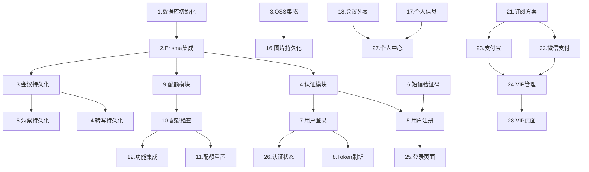

# 实施计划: 用户管理与平台商业化系统

## 阶段一：基础设施搭建 (P0)

- [1]. 数据库初始化
  - 安装配置 PostgreSQL
  - 安装配置 Redis
  - 创建数据库和用户
  - 需求: 需求3

- [2]. Prisma ORM 集成
  - 安装 Prisma 依赖
  - 创建 schema.prisma 定义数据模型
  - 生成迁移文件并执行
  - 配置 Prisma Client
  - 需求: 需求3

- [3]. 阿里云 OSS 集成
  - 创建 OSS Bucket
  - 安装 ali-oss SDK
  - 创建 StorageModule 封装上传/下载方法
  - 配置 CORS 和访问策略
  - 需求: 需求3

---

## 阶段二：用户认证系统 (P0)

- [4]. 认证模块基础
  - 创建 AuthModule
  - 安装 @nestjs/passport, passport-jwt, bcrypt
  - 配置 JWT 策略
  - 创建 AuthGuard
  - 需求: 需求1, 需求6

- [5]. 用户注册功能
  - 创建 UserModule 和 UserService
  - 实现邮箱注册接口 POST /auth/register
  - 密码 bcrypt 加密
  - 自动初始化用户配额
  - 需求: 需求1

- [6]. 短信验证码功能
  - 集成阿里云短信服务
  - 实现发送验证码接口 POST /auth/send-code
  - Redis 存储验证码（5分钟过期）
  - 验证码校验逻辑
  - 需求: 需求1

- [7]. 用户登录功能
  - 实现登录接口 POST /auth/login
  - 密码验证
  - JWT Token 生成
  - 登录失败次数限制（Redis 计数）
  - 需求: 需求1, 需求6

- [8]. Token 刷新与登出
  - 实现 Token 刷新接口 POST /auth/refresh
  - 实现登出接口 POST /auth/logout
  - Token 黑名单机制
  - 需求: 需求1

---

## 阶段三：配额管理系统 (P0)

- [9]. 配额模块基础
  - 创建 QuotaModule 和 QuotaService
  - 实现配额状态查询接口 GET /quota/status
  - Redis 缓存配额数据
  - 需求: 需求4

- [10]. 配额检查与扣减
  - 实现配额检查方法 checkQuota(userId, type)
  - 实现配额扣减方法 consumeQuota(userId, type, amount)
  - 配额不足时返回友好提示
  - 需求: 需求4

- [11]. 配额自动重置
  - 创建定时任务（@nestjs/schedule）
  - 每日 0 点重置日配额
  - 每月 1 日重置月配额
  - 需求: 需求4

- [12]. 现有功能配额集成
  - 修改 SkillService（inner_os/brainstorm/stop_talking）添加配额检查
  - 修改 VisualizationService（chart/creative/poster）添加配额检查
  - 修改 SessionService.askQuestion 添加配额检查
  - 修改 AutoPushService 添加配额检查
  - 需求: 需求4

---

## 阶段四：数据持久化 (P0)

- [13]. 会议数据持久化
  - 修改 SessionService 创建会议时写入数据库
  - 关联会议到当前登录用户
  - 会议结束时更新状态和时长
  - 需求: 需求3

- [14]. 转写内容持久化
  - 修改 ContextStoreService 同步写入数据库
  - 批量插入优化（每 10 条或每 5 秒）
  - 保留现有内存缓存用于实时查询
  - 需求: 需求3

- [15]. 洞察内容持久化
  - 修改 SkillService 保存技能结果到数据库
  - 支持 inner_os/brainstorm/stop_talking 三种类型
  - 关联到对应会议记录
  - 需求: 需求3

- [16]. 可视化图片持久化
  - 修改 VisualizationService 保存图片到 OSS
  - 支持 chart/creative/poster 三种类型
  - 数据库记录图片 URL 和元数据（chartType 等）
  - 需求: 需求3

---

## 阶段五：用户中心 (P1)

- [17]. 个人信息接口
  - 实现获取用户信息 GET /users/me
  - 实现更新用户信息 PATCH /users/me
  - 头像上传到 OSS
  - 需求: 需求2

- [18]. 历史会议列表
  - 实现会议列表接口 GET /users/me/meetings
  - 分页查询
  - 返回会议摘要信息
  - 需求: 需求2, 需求3

- [19]. 会议详情与回放
  - 实现会议详情接口 GET /meetings/:id
  - 返回完整转写、洞察、可视化
  - 权限校验（只能查看自己的会议）
  - 需求: 需求3

- [20]. 会议删除功能
  - 实现软删除接口 DELETE /meetings/:id
  - 30 天后定时任务彻底删除
  - 需求: 需求3

---

## 阶段六：VIP 订阅系统 (P1)

- [21]. 订阅方案接口
  - 创建 SubscriptionModule
  - 实现获取方案接口 GET /subscription/plans
  - 需求: 需求5

- [22]. 微信支付集成
  - 安装 wechatpay-node-v3 SDK
  - 配置商户号和证书
  - 实现创建订单接口
  - 实现支付回调处理
  - 需求: 需求5

- [23]. 支付宝集成
  - 安装 alipay-sdk
  - 配置应用密钥
  - 实现创建订单接口
  - 实现支付回调处理
  - 需求: 需求5

- [24]. VIP 状态管理
  - 支付成功后更新用户 VIP 状态
  - 重置配额到 VIP 标准
  - VIP 到期自动降级
  - 到期前 3 天发送提醒
  - 需求: 需求5

---

## 阶段七：前端改造 (P0/P1)

- [25]. 登录注册页面
  - 创建登录页面 UI
  - 创建注册页面 UI
  - 表单验证
  - 调用认证接口
  - 需求: 需求1

- [26]. 认证状态管理
  - Token 存储到 localStorage
  - 请求拦截器添加 Authorization 头
  - Token 过期自动刷新
  - 未登录重定向到登录页
  - 需求: 需求1, 需求7

- [27]. 个人中心页面
  - 创建个人中心 UI
  - 显示用户信息和配额状态
  - 会议历史列表
  - 需求: 需求2

- [28]. VIP 订阅页面
  - 创建 VIP 权益展示页
  - 定价方案选择
  - 支付二维码/跳转
  - 需求: 需求5

- [29]. 配额提示优化
  - 配额不足时显示弹窗
  - 引导升级 VIP
  - 显示剩余配额
  - 需求: 需求4, 需求7

---

## 阶段八：体验优化 (P1/P2)

- [30]. 新手引导
  - 首次登录显示引导流程
  - 功能介绍 Tooltip
  - 需求: 需求7

- [31]. 错误处理优化
  - 统一错误响应格式
  - 网络异常友好提示
  - 重试机制
  - 需求: 需求7

- [32]. 移动端适配
  - 响应式布局调整
  - 触摸交互优化
  - 需求: 需求7

- [33]. 性能优化
  - 首屏加载优化
  - 图片懒加载
  - API 响应缓存
  - 需求: 需求7

---

## 阶段九：安全与合规 (P0)

- [34]. 安全加固
  - 接口 Rate Limiting
  - SQL 注入防护（Prisma 已内置）
  - XSS 防护
  - CORS 配置
  - 需求: 需求6

- [35]. 隐私合规
  - 创建隐私政策页面
  - 创建用户协议页面
  - 注册时同意条款
  - 需求: 需求6

- [36]. 账户注销
  - 实现注销接口
  - 7 天冷静期
  - 数据彻底删除
  - 需求: 需求6

---

## 任务依赖关系

---

## 里程碑计划

| 里程碑 | 包含任务 | 预计时间 | 目标 |
|--------|----------|----------|------|
| M1 | 1-8 | 3天 | 用户可注册登录 |
| M2 | 9-12 | 2天 | 配额系统上线 |
| M3 | 13-16 | 2天 | 数据持久化完成 |
| M4 | 17-20, 25-27 | 3天 | 用户中心可用 |
| M5 | 21-24, 28 | 3天 | VIP 订阅上线 |
| M6 | 29-36 | 3天 | 体验优化完成 |

**总计：约 16 个工作日**

---

## 附录：现有模块改造清单

| 现有模块 | 改造内容 | 关联任务 |
|----------|----------|----------|
| `SessionService` | 添加用户关联、数据库存储 | 任务 13 |
| `ContextStoreService` | 添加数据库持久化（保留内存缓存） | 任务 14 |
| `SkillService` | 添加配额检查、结果持久化 | 任务 12, 15 |
| `VisualizationService` | 添加配额检查、OSS 存储 | 任务 12, 16 |
| `AutoPushService` | 添加配额检查 | 任务 12 |

### 现有技能类型
- `inner_os` - 内心OS洞察
- `brainstorm` - 头脑风暴
- `stop_talking` - 跑题检测

### 现有可视化类型
- `chart` - 数据图表（支持 radar/flowchart/architecture/bar/line）
- `creative` - 创意图像
- `poster` - 逻辑海报
