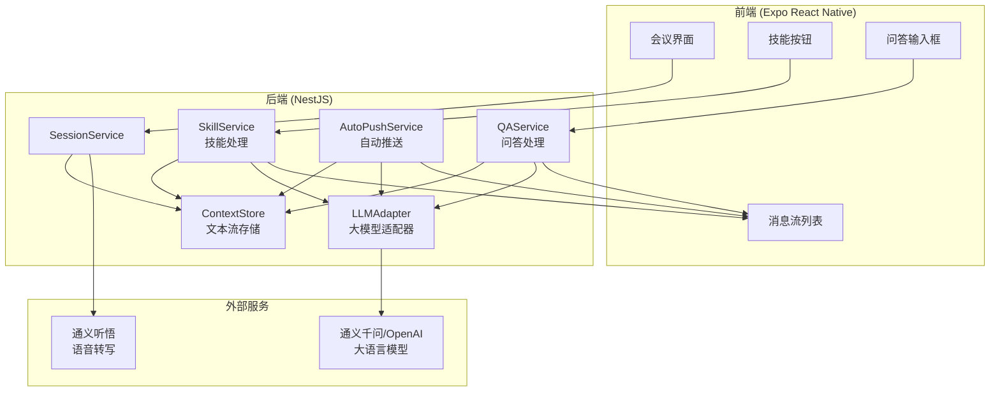
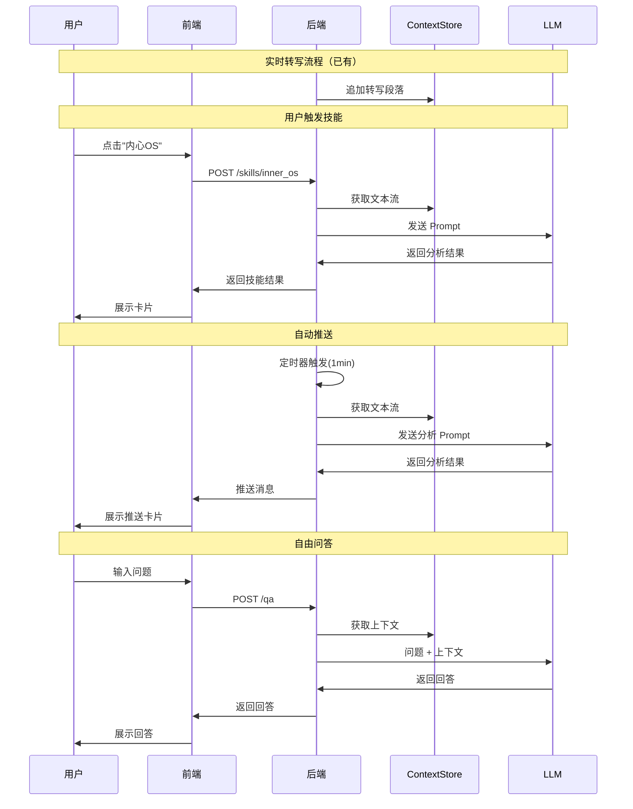

# 技术方案设计: 会议快照 V1

## 1. 系统架构



## 2. 技术栈

| 层级 | 技术选型 | 说明 |
|------|---------|------|
| 前端 | Expo React Native | 已有，复用 |
| 后端 | NestJS + TypeScript | 已有，复用 |
| 语音转写 | 通义听悟 | 已有，复用 |
| 大语言模型 | **Qwen3-Max** | 新增，OpenAI 兼容 API |
| 存储 | 内存 Map（后续可换 Redis） | 文本流存储 |

### 现有实现说明

**已有的数据存储（SessionService）：**
- `sessions`: Map<sessionId, {taskId, meetingJoinUrl}>
- `transcripts`: Map<sessionId, Transcript[]> - 转写段落
- `summaries`: Map<sessionId, SummaryCard[]> - 摘要卡片
- `taskStatuses`: Map<sessionId, string> - 任务状态

**V1 扩展方案：**
- 新增 `ContextStore` 服务，专门管理**文本流上下文**
- 与现有 `SessionService` 协作，不替换
- `ContextStore` 聚焦于为 LLM 提供上下文，`SessionService` 聚焦于会话生命周期

### Qwen3-Max 模型特性

- **参数规模**: 超过 1T 参数，36T tokens 预训练
- **性能排名**: LMArena 第三，超越 GPT-5-Chat
- **版本**: Instruct（指令跟随）/ Thinking（深度推理）
- **API**: OpenAI 兼容模式，可直接使用 openai SDK

## 3. 核心模块设计

### 3.1 ContextStore - 文本流存储

```typescript
// 通义听悟 WebSocket 返回格式（TranscriptionResultChanged）
interface TingwuTranscriptionPayload {
  result: string;                    // 转写文本
  words: TingwuWord[];               // 词级别时间戳
  index: number;                     // 段落索引
  time: number;                      // 结束时间 (ms)
  confidence: number;                // 置信度
  fixed_result: string;              // 修正后的文本
}

interface TingwuWord {
  startTime: number;                 // 开始时间 (ms)
  endTime: number;                   // 结束时间 (ms)
  text: string;                      // 词文本
  fixed?: boolean;                   // 是否已修正
  punc?: string;                     // 标点符号
}

// 内部存储结构（简化，不区分说话人）
interface ContextSegment {
  id: string;                        // 段落ID (基于 index)
  text: string;                      // 转写文本
  startMs: number;                   // 开始时间
  endMs: number;                     // 结束时间
  timestamp: Date;                   // 接收时间
}

interface SessionContext {
  sessionId: string;
  segments: ContextSegment[];        // 转写段落
  messages: ChatMessage[];           // 对话消息（技能结果、问答）
  meetingPhase: string;              // 会议阶段
  lastAutoAnalysis: Date;            // 上次自动分析时间
}

// 核心方法
class ContextStore {
  // 从通义听悟格式转换并追加
  appendFromTingwu(sessionId: string, payload: TingwuTranscriptionPayload): void;
  getFullText(sessionId: string): string;           // 获取完整文本流
  getRecentText(sessionId: string, minutes: number): string; // 获取最近N分钟
  appendMessage(sessionId: string, message: ChatMessage): void;
}
```

#### 通义听悟返回格式示例

```json
{
  "header": {
    "task_id": "f6c8130aa3ed43598372664b1047abd5",
    "namespace": "SpeechTranscriber",
    "name": "TranscriptionResultChanged",
    "status": 20000000,
    "status_text": "Success."
  },
  "payload": {
    "result": "主要是PGLP one, p two",
    "words": [
      {"startTime": 47231, "text": "主要", "endTime": 47839},
      {"startTime": 47839, "text": "是", "endTime": 48143},
      {"startTime": 48143, "text": "P", "endTime": 48447},
      {"startTime": 48447, "text": "G", "endTime": 48751}
    ],
    "index": 2,
    "time": 51240,
    "confidence": 0
  }
}
```

### 3.2 SkillService - 技能处理（重构）

**现有实现：** 使用通义听悟的 `CustomPrompt` API
```typescript
// tingwu.service.ts - 现有实现
async triggerCustomPrompt(taskId: string, type: "inner_os" | "brainstorm") {
  // 调用通义听悟 /custom-prompt 接口
}
```

**V1 重构：** 改用 Qwen3-Max + 自定义 Prompt

```typescript
type SkillType = 'inner_os' | 'brainstorm' | 'stop_talking';

class SkillService {
  constructor(
    private contextStore: ContextStore,
    private llmAdapter: LLMAdapter,
  ) {}
  
  async triggerSkill(sessionId: string, skill: SkillType): Promise<SkillResult>;
}
```

**技能 Prompt 设计：**

| 技能 | 角色设定 | 输入 | 输出格式 |
|------|---------|------|---------|
| inner_os | 洞察力强的毒舌观察者 | 最近5分钟文本 | `[{emotion, innerThought, quote}]` |
| brainstorm | 乔布斯风格创意顾问 | 全部文本 | `[{idea, rationale, challenge}]` |
| stop_talking | 会议主持人 | 全部文本 | `{isOffTopic, mainTopic, reminder}` |

**迁移说明：**
- 保留现有 API 端点 `POST /sessions/:id/skills/:skill`
- 内部实现从通义听悟 CustomPrompt 切换到 Qwen3-Max
- 新增 `stop_talking` 技能

### 3.3 AutoPushService - 自动推送

```typescript
class AutoPushService {
  private interval = 60000; // 1分钟
  
  startAutoAnalysis(sessionId: string): void;
  stopAutoAnalysis(sessionId: string): void;
  
  private async analyze(sessionId: string): Promise<AutoAnalysisResult> {
    // 1. 获取完整文本流
    // 2. 调用 LLM 进行多维度分析
    // 3. 推送结果到前端
  }
}

interface AutoAnalysisResult {
  phase: string;           // 会议阶段
  keyPoints: string[];     // 核心关键点
  innerOS?: string;        // 潜台词洞察
  expertAdvice?: string;   // 专家建议
  offTopicAlert?: string;  // 偏题提醒
}
```

### 3.4 QAService - 问答处理

```typescript
class QAService {
  async ask(sessionId: string, question: string): Promise<string>;
}
```

### 3.5 LLMAdapter - 大模型适配器

```typescript
import OpenAI from 'openai';

class LLMAdapter {
  private client: OpenAI;
  
  constructor(config: LLMConfig) {
    this.client = new OpenAI({
      apiKey: config.apiKey,
      baseURL: config.baseUrl || 'https://dashscope.aliyuncs.com/compatible-mode/v1',
    });
  }
  
  async chat(messages: ChatMessage[], options?: LLMOptions): Promise<string>;
  async chatWithPrompt(systemPrompt: string, userContent: string): Promise<string>;
  async chatStream(messages: ChatMessage[], onChunk: (chunk: string) => void): Promise<void>;
}

// 配置
interface LLMConfig {
  apiKey: string;                    // DASHSCOPE_API_KEY
  model: string;                     // qwen3-max
  baseUrl?: string;                  // OpenAI 兼容端点
}

interface LLMOptions {
  temperature?: number;              // 0-2，默认 0.7
  topP?: number;                     // 0-1
  maxTokens?: number;                // 最大生成长度
  stream?: boolean;                  // 是否流式
}
```

#### Qwen3-Max API 调用示例

```typescript
// 使用 OpenAI SDK 调用 Qwen3-Max
import OpenAI from 'openai';

const client = new OpenAI({
  apiKey: process.env.DASHSCOPE_API_KEY,
  baseURL: 'https://dashscope.aliyuncs.com/compatible-mode/v1',
});

const completion = await client.chat.completions.create({
  model: 'qwen3-max',
  messages: [
    { role: 'system', content: '你是一个会议分析助手。' },
    { role: 'user', content: '分析以下会议内容...' }
  ],
  temperature: 0.7,
  max_tokens: 2000,
  stream: false,
});

console.log(completion.choices[0].message.content);
```

## 4. API 设计

### 现有接口（保留）

| 方法 | 路径 | 说明 |
|------|------|------|
| POST | `/sessions` | 创建会话 |
| POST | `/sessions/:id/audio` | 上传音频分片 |
| POST | `/sessions/:id/process` | 处理缓存的音频 |
| GET | `/sessions/:id/transcripts` | 获取转写结果 |
| GET | `/sessions/:id/summaries` | 获取摘要卡片 |
| POST | `/sessions/:id/skills/:skill` | 触发技能（inner_os/brainstorm） |
| POST | `/sessions/:id/complete` | 结束会话 |

### 新增接口

| 方法 | 路径 | 说明 |
|------|------|------|
| POST | `/sessions/:id/skills/stop_talking` | 新增纠偏技能 |
| POST | `/sessions/:id/qa` | 自由问答 |
| POST | `/sessions/:id/auto-push/start` | 开启自动推送 |
| POST | `/sessions/:id/auto-push/stop` | 关闭自动推送 |
| GET | `/sessions/:id/messages` | 获取消息流（技能结果+问答+推送） |

### 请求/响应示例

```typescript
// POST /sessions/:id/qa
// Request
{ "question": "刚才提到的三个风险是什么？" }

// Response
{
  "answer": "根据会议记录，提到的三个风险是：1. ...",
  "messageId": "msg-xxx"
}

// POST /sessions/:id/auto-push/start
// Response
{ "ok": true, "interval": 60000 }
```

## 5. Prompt 工程

### 5.1 内心 OS Prompt

```
你是一个洞察力极强、略带毒舌风格的会议观察者。

任务：分析以下会议对话，识别其中的潜台词、话外音和未说出口的想法。

要求：
1. 找出3-5个有趣的"内心OS"
2. 每个OS包含：可能的真实想法、对应的原话引用
3. 风格要犀利但不失幽默

会议内容：
{context}

输出JSON格式：
[{"quote": "原话", "innerThought": "内心OS", "emotion": "情绪"}]
```

### 5.2 头脑风暴 Prompt

```
你是史蒂夫·乔布斯风格的创意顾问，以颠覆性思维和极简主义著称。

任务：基于当前会议讨论，提供跳跃性的创意建议。

要求：
1. 提供3-5个突破性想法
2. 每个想法要有乔布斯式的洞察
3. 敢于挑战现有假设

会议内容：
{context}

输出JSON格式：
[{"idea": "创意", "rationale": "乔布斯式解释", "challenge": "挑战的假设"}]
```

### 5.3 纠偏 Prompt

```
你是一位专业的会议主持人，负责确保讨论聚焦于核心议题。

任务：分析当前讨论是否偏离主题，如有需要给出礼貌但坚定的提醒。

会议内容：
{context}

分析要点：
1. 当前讨论的主线是什么
2. 是否有明显的跑题现象
3. 如何优雅地引导回正轨

输出JSON格式：
{"isOffTopic": boolean, "mainTopic": "主线", "deviation": "偏离点", "reminder": "提醒话术"}
```

### 5.4 自动分析 Prompt

```
你是一位资深的会议分析师，负责实时监控会议状态。

任务：分析当前会议进展，提供多维度洞察。

会议内容：
{context}

请分析：
1. 会议阶段（开场/讨论/争论/决策/总结）
2. 3个核心关键点
3. 潜在的逻辑漏洞或盲点
4. 是否需要专家介入的建议

输出JSON格式：
{
  "phase": "阶段",
  "keyPoints": ["关键点1", "关键点2", "关键点3"],
  "blindSpots": ["盲点"],
  "expertAdvice": "专家建议（可选）"
}
```

## 6. 数据流



## 7. 配置项

```env
# .env 新增配置

# Qwen3-Max API 配置（OpenAI 兼容模式）
DASHSCOPE_API_KEY=sk-xxxxx           # 阿里云百炼 API Key
LLM_MODEL=qwen3-max                   # 模型名称
LLM_BASE_URL=https://dashscope.aliyuncs.com/compatible-mode/v1  # OpenAI 兼容端点

# LLM 参数
LLM_TEMPERATURE=0.7                   # 采样温度
LLM_MAX_TOKENS=2000                   # 最大生成长度

# 自动推送配置
AUTO_PUSH_INTERVAL_MS=60000           # 自动推送间隔，默认1分钟
AUTO_PUSH_ENABLED=true                # 是否默认开启自动推送
```

### API Key 获取步骤

1. 登录 [阿里云百炼控制台](https://bailian.console.aliyun.com/)
2. 进入 API Key 管理页面
3. 创建新的 API Key
4. 将 API Key 配置到 `.env` 文件的 `DASHSCOPE_API_KEY`

## 8. 测试策略

| 测试类型 | 覆盖范围 |
|---------|---------|
| 单元测试 | ContextStore、Prompt 模板 |
| 集成测试 | LLMAdapter 与真实 API |
| E2E 测试 | 完整技能触发流程 |
| 手动测试 | 自动推送时机、消息展示 |

---

**请确认以上技术方案是否符合预期，确认后我将进行任务拆分。**
