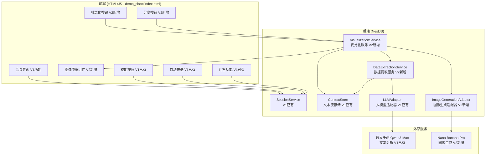
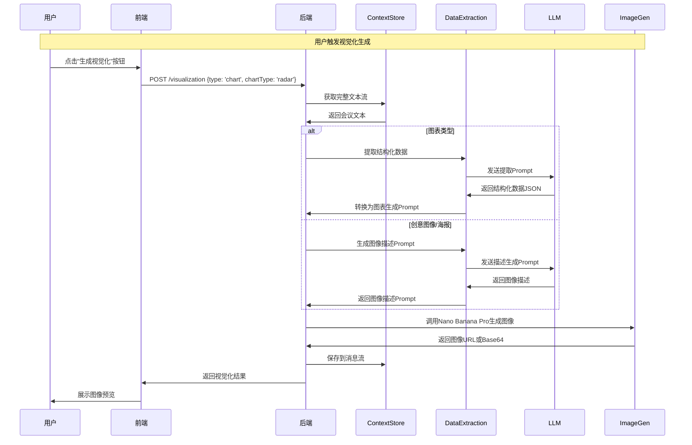

# 技术方案设计: 会议快照 V2 - 视觉化共识

## 1. 系统架构



## 2. 技术栈

| 层级 | 技术选型 | 说明 |
|------|---------|------|
| 前端 | **HTML/JavaScript** (demo_show/index.html) | V1已有，V2在此基础上扩展 |
| 后端 | NestJS + TypeScript | V1已有，V2新增模块 |
| 文本分析 | **Qwen3-Max** | V1已有，V2复用 |
| 图像生成 | **Nano Banana Pro** | V2新增，需确认API |
| 存储 | 内存 Map（后续可换 Redis） | V1已有，V2复用 |
| 图像存储 | 本地文件系统或对象存储 | V2新增 |

### 现有实现说明

**V1 已有的模块（完全复用，不修改）：**
- `ContextStore` - 文本流存储
- `LLMAdapterService` - LLM适配器（Qwen3-Max）
- `SessionService` - 会话管理
- `SkillService` - 技能服务
- `AutoPushService` - 自动推送
- `demo_show/index.html` - 前端HTML页面（包含V1所有功能）

**V2 新增模块：**
- `VisualizationService` - 视觉化服务（核心协调模块）
- `DataExtractionService` - 结构化数据提取服务
- `ImageGenerationAdapter` - 图像生成适配器（封装Nano Banana Pro）

**V2 前端扩展：**
- 在 `demo_show/index.html` 基础上新增视觉化相关UI组件
- 保持V1所有功能完整，不修改现有功能代码
- 新增视觉化按钮、图像预览、类型选择器等组件

## 3. 核心模块设计

### 3.1 VisualizationService - 视觉化服务

```typescript
type VisualizationType = 'chart' | 'creative' | 'poster';

interface VisualizationRequest {
  sessionId: string;
  type: VisualizationType;
  chartType?: 'radar' | 'flowchart' | 'architecture' | 'bar' | 'line'; // 仅当type='chart'时使用
}

interface VisualizationResult {
  id: string;
  sessionId: string;
  type: VisualizationType;
  imageUrl?: string;           // 图像URL（如果Nano Banana Pro返回URL）
  imageBase64?: string;        // Base64图像数据（如果返回Base64）
  prompt: string;              // 使用的生成提示词
  metadata: {
    chartType?: string;        // 图表类型（如果是图表）
    dataStructure?: any;       // 提取的结构化数据（如果是图表）
    description?: string;      // 创意描述（如果是创意图像）
  };
  createdAt: Date;
}

@Injectable()
export class VisualizationService {
  constructor(
    private contextStore: ContextStoreService,
    private dataExtractionService: DataExtractionService,
    private imageGenAdapter: ImageGenerationAdapter,
  ) {}

  async generateVisualization(
    request: VisualizationRequest
  ): Promise<VisualizationResult> {
    // 1. 获取会议文本流上下文
    const context = this.contextStore.getFullText(request.sessionId);
    
    // 2. 根据类型生成提示词
    let prompt: string;
    let metadata: any;
    
    if (request.type === 'chart') {
      // 提取结构化数据
      const data = await this.dataExtractionService.extractChartData(
        context,
        request.chartType!
      );
      // 转换为绘图指令
      prompt = this.dataExtractionService.toChartPrompt(data, request.chartType!);
      metadata = { chartType: request.chartType, dataStructure: data };
    } else if (request.type === 'creative') {
      // 生成创意图像描述
      prompt = await this.dataExtractionService.generateCreativePrompt(context);
      metadata = { description: prompt };
    } else {
      // 生成逻辑海报描述
      prompt = await this.dataExtractionService.generatePosterPrompt(context);
      metadata = { description: prompt };
    }
    
    // 3. 调用图像生成
    const imageResult = await this.imageGenAdapter.generate(prompt, {
      type: request.type,
      chartType: request.chartType,
    });
    
    // 4. 保存结果
    const result: VisualizationResult = {
      id: `vis-${Date.now()}`,
      sessionId: request.sessionId,
      type: request.type,
      imageUrl: imageResult.url,
      imageBase64: imageResult.base64,
      prompt,
      metadata,
      createdAt: new Date(),
    };
    
    // 5. 保存到消息流
    this.contextStore.appendMessage(request.sessionId, {
      id: result.id,
      type: 'visualization',
      content: result,
      timestamp: result.createdAt,
    });
    
    return result;
  }
}
```

### 3.2 DataExtractionService - 结构化数据提取服务

```typescript
interface ChartData {
  type: 'radar' | 'flowchart' | 'architecture' | 'bar' | 'line';
  data: any;  // 根据类型不同，数据结构不同
}

@Injectable()
export class DataExtractionService {
  constructor(
    private llmAdapter: LLMAdapterService,
  ) {}

  /**
   * 提取图表数据
   */
  async extractChartData(
    context: string,
    chartType: string
  ): Promise<ChartData> {
    const prompt = this.buildExtractionPrompt(context, chartType);
    const response = await this.llmAdapter.chatForJson([
      {
        role: 'system',
        content: '你是一个数据分析专家，擅长从会议文本中提取结构化数据。',
      },
      {
        role: 'user',
        content: prompt,
      },
    ]);
    
    return JSON.parse(response) as ChartData;
  }

  /**
   * 转换为图表生成提示词
   */
  toChartPrompt(data: ChartData, chartType: string): string {
    // 根据图表类型和数据结构，生成Nano Banana Pro可理解的绘图指令
    // 例如：对于雷达图，生成类似 "Create a radar chart with dimensions: [维度列表], values: [数值列表]"
    switch (chartType) {
      case 'radar':
        return this.buildRadarChartPrompt(data);
      case 'flowchart':
        return this.buildFlowchartPrompt(data);
      case 'architecture':
        return this.buildArchitecturePrompt(data);
      default:
        return this.buildGenericChartPrompt(data, chartType);
    }
  }

  /**
   * 生成创意图像提示词
   */
  async generateCreativePrompt(context: string): Promise<string> {
    const prompt = `
分析以下会议内容，提取核心情绪、愿景和关键观点，生成一个高质量的图像生成提示词。

会议内容：
${context}

要求：
1. 识别会议的核心主题和情绪（如：创新、协作、挑战、成功等）
2. 提取关键视觉元素（如：概念、隐喻、象征）
3. 确定色彩方案（如：温暖色调、科技蓝、高对比度等）
4. 确定图像风格（如：现代商务、创意插画、科技感等）
5. 确定构图要求（如：居中、对称、动态等）

输出格式：直接输出图像生成提示词，用英文描述，详细且具体。
`;
    
    return await this.llmAdapter.chatWithPrompt(
      '你是一个专业的图像生成提示词工程师，擅长将抽象概念转化为视觉描述。',
      prompt
    );
  }

  /**
   * 生成逻辑海报提示词
   */
  async generatePosterPrompt(context: string): Promise<string> {
    const prompt = `
分析以下会议内容，生成一个逻辑海报的图像生成提示词。

会议内容：
${context}

要求：
1. 提取会议的核心要点（3-5个）
2. 识别逻辑关系（如：因果关系、层级关系、时间顺序等）
3. 设计海报布局（如：思维导图、决策树、要点列表等）
4. 确定视觉风格（如：简洁商务、创意设计、信息图表等）

输出格式：直接输出图像生成提示词，用英文描述，详细且具体。
`;
    
    return await this.llmAdapter.chatWithPrompt(
      '你是一个专业的信息图表设计师，擅长将复杂信息转化为清晰的视觉表达。',
      prompt
    );
  }

  private buildExtractionPrompt(context: string, chartType: string): string {
    // 根据图表类型构建不同的提取提示词
    // ...
  }

  private buildRadarChartPrompt(data: ChartData): string {
    // 构建雷达图生成提示词
    // ...
  }

  private buildFlowchartPrompt(data: ChartData): string {
    // 构建流程图生成提示词
    // ...
  }

  private buildArchitecturePrompt(data: ChartData): string {
    // 构建架构图生成提示词
    // ...
  }

  private buildGenericChartPrompt(data: ChartData, chartType: string): string {
    // 构建通用图表生成提示词
    // ...
  }
}
```

### 3.3 ImageGenerationAdapter - 图像生成适配器

```typescript
interface ImageGenerationOptions {
  type: 'chart' | 'creative' | 'poster';
  chartType?: string;
  size?: string;        // 如：'1024x1024'
  format?: string;      // 如：'png', 'jpg'
  quality?: string;     // 如：'standard', 'hd'
}

interface ImageGenerationResult {
  url?: string;         // 图像URL（如果API返回URL）
  base64?: string;      // Base64图像数据（如果API返回Base64）
  metadata?: any;       // 其他元数据
}

@Injectable()
export class ImageGenerationAdapter {
  private readonly logger = new Logger(ImageGenerationAdapter.name);
  private readonly apiKey: string;
  private readonly baseUrl: string;
  private readonly model: string;

  constructor(private readonly configService: ConfigService) {
    // 配置从环境变量读取
    this.apiKey = this.configService.get<string>('imageGen.apiKey') ?? 
                  this.configService.get<string>('llm.apiKey') ?? ''; // 可能复用DASHSCOPE_API_KEY
    this.baseUrl = this.configService.get<string>('imageGen.baseUrl') ?? 
                   'https://dashscope.aliyuncs.com/api/v1/services/aigc/image-generation/generation'; // 待确认
    this.model = this.configService.get<string>('imageGen.model') ?? 
                 'nano-banana-pro'; // 待确认
  }

  async generate(
    prompt: string,
    options?: ImageGenerationOptions
  ): Promise<ImageGenerationResult> {
    try {
      // 调用Nano Banana Pro API
      // 具体实现需根据API文档确认
      const response = await this.callImageGenerationAPI(prompt, options);
      
      // 处理响应（可能是URL或Base64）
      return this.processResponse(response);
    } catch (error) {
      this.logger.error('Image generation failed', error);
      throw new InternalServerErrorException('Image generation failed');
    }
  }

  private async callImageGenerationAPI(
    prompt: string,
    options?: ImageGenerationOptions
  ): Promise<any> {
    // 根据Nano Banana Pro API文档实现
    // 示例（待确认）：
    const response = await fetch(this.baseUrl, {
      method: 'POST',
      headers: {
        'Authorization': `Bearer ${this.apiKey}`,
        'Content-Type': 'application/json',
      },
      body: JSON.stringify({
        model: this.model,
        prompt: prompt,
        size: options?.size ?? '1024x1024',
        format: options?.format ?? 'png',
        quality: options?.quality ?? 'standard',
      }),
    });
    
    return await response.json();
  }

  private processResponse(response: any): ImageGenerationResult {
    // 处理API响应，提取图像URL或Base64
    // 具体格式待确认
    if (response.data?.url) {
      return { url: response.data.url };
    } else if (response.data?.base64) {
      return { base64: response.data.base64 };
    } else {
      throw new Error('Invalid response format');
    }
  }
}
```

## 4. 前端UI设计（基于 demo_show/index.html）

### 4.1 视觉化功能区域（新增）

在现有的 `side-panel` 区域下方，新增视觉化功能卡片：

```html
<!-- 在 side-panel 中，QA Section 之前添加 -->
<div class="visualization-card">
  <div class="visualization-header">
    <h4 class="visualization-title">视觉化共识</h4>
    <span class="visualization-badge">V2</span>
  </div>
  
  <!-- 视觉化类型选择 -->
  <div class="visualization-type-selector">
    <button class="vis-type-btn active" data-type="chart" onclick="selectVisualizationType('chart')">
      📊 科研图表
    </button>
    <button class="vis-type-btn" data-type="creative" onclick="selectVisualizationType('creative')">
      🎨 创意图像
    </button>
    <button class="vis-type-btn" data-type="poster" onclick="selectVisualizationType('poster')">
      📋 逻辑海报
    </button>
  </div>
  
  <!-- 图表类型选择（仅当选择"科研图表"时显示） -->
  <div class="chart-type-selector" id="chartTypeSelector" style="display: none;">
    <select class="chart-type-select" id="chartTypeSelect">
      <option value="radar">雷达图</option>
      <option value="flowchart">流程图</option>
      <option value="architecture">架构图</option>
      <option value="bar">柱状图</option>
      <option value="line">折线图</option>
    </select>
  </div>
  
  <!-- 生成按钮 -->
  <button class="vis-generate-btn" id="visGenerateBtn" onclick="generateVisualization()" disabled>
    <span>✨</span>
    <span>生成视觉化</span>
  </button>
  
  <!-- 生成状态 -->
  <div class="vis-status" id="visStatus" style="display: none;">
    <div class="vis-status-loading">生成中...</div>
  </div>
</div>

<!-- 视觉化结果展示区域（在 transcription-panel 的 summary tab 中新增） -->
<div id="visualizationList" style="display: none;">
  <!-- 动态插入视觉化结果卡片 -->
</div>
```

### 4.2 视觉化结果卡片样式

```css
.visualization-card {
  background: var(--bg-card);
  border: 1px solid var(--border-subtle);
  border-radius: var(--radius-md);
  padding: 20px;
  margin-bottom: 20px;
}

.visualization-header {
  display: flex;
  justify-content: space-between;
  align-items: center;
  margin-bottom: 16px;
}

.visualization-title {
  font-weight: 600;
  font-size: 1.125rem;
}

.visualization-badge {
  padding: 4px 10px;
  background: var(--accent-secondary);
  border-radius: 100px;
  font-size: 0.75rem;
  font-weight: 600;
}

.visualization-type-selector {
  display: flex;
  gap: 8px;
  margin-bottom: 12px;
}

.vis-type-btn {
  flex: 1;
  padding: 10px 12px;
  background: rgba(0, 0, 0, 0.2);
  border: 1px solid var(--border-subtle);
  border-radius: var(--radius-sm);
  color: var(--text-secondary);
  font-size: 0.875rem;
  cursor: pointer;
  transition: all 0.2s ease;
}

.vis-type-btn:hover {
  background: var(--bg-card-hover);
  border-color: var(--border-active);
}

.vis-type-btn.active {
  background: var(--accent-primary);
  color: white;
  border-color: var(--accent-primary);
}

.chart-type-selector {
  margin-bottom: 12px;
}

.chart-type-select {
  width: 100%;
  padding: 10px 12px;
  background: rgba(0, 0, 0, 0.2);
  border: 1px solid var(--border-subtle);
  border-radius: var(--radius-sm);
  color: var(--text-primary);
  font-size: 0.875rem;
  outline: none;
}

.vis-generate-btn {
  width: 100%;
  padding: 14px 20px;
  background: var(--gradient-hero);
  border: none;
  border-radius: var(--radius-md);
  color: white;
  font-weight: 600;
  font-size: 0.9375rem;
  cursor: pointer;
  transition: all 0.3s ease;
  display: flex;
  align-items: center;
  justify-content: center;
  gap: 8px;
}

.vis-generate-btn:hover:not(:disabled) {
  transform: translateY(-2px);
  box-shadow: var(--shadow-glow);
}

.vis-generate-btn:disabled {
  opacity: 0.5;
  cursor: not-allowed;
}

.vis-status {
  margin-top: 12px;
  padding: 12px;
  background: rgba(99, 102, 241, 0.1);
  border: 1px solid rgba(99, 102, 241, 0.3);
  border-radius: var(--radius-sm);
  font-size: 0.875rem;
  color: var(--accent-primary);
}

/* 视觉化结果卡片 */
.visualization-item {
  background: var(--bg-card);
  border: 1px solid var(--border-subtle);
  border-radius: var(--radius-lg);
  padding: 20px;
  margin-bottom: 16px;
}

.visualization-item-header {
  display: flex;
  justify-content: space-between;
  align-items: center;
  margin-bottom: 12px;
}

.visualization-item-type {
  padding: 4px 10px;
  background: var(--bg-card-hover);
  border-radius: 100px;
  font-size: 0.75rem;
  color: var(--text-secondary);
}

.visualization-item-actions {
  display: flex;
  gap: 8px;
}

.vis-action-btn {
  padding: 6px 12px;
  background: rgba(0, 0, 0, 0.2);
  border: 1px solid var(--border-subtle);
  border-radius: var(--radius-sm);
  color: var(--text-secondary);
  font-size: 0.75rem;
  cursor: pointer;
  transition: all 0.2s ease;
}

.vis-action-btn:hover {
  background: var(--bg-card-hover);
  border-color: var(--border-active);
}

.visualization-image {
  width: 100%;
  border-radius: var(--radius-md);
  margin-bottom: 12px;
  cursor: pointer;
  transition: transform 0.2s ease;
}

.visualization-image:hover {
  transform: scale(1.02);
}

.visualization-metadata {
  font-size: 0.75rem;
  color: var(--text-muted);
}

/* 图像查看器模态框 */
.vis-modal {
  display: none;
  position: fixed;
  inset: 0;
  z-index: 1000;
  background: rgba(0, 0, 0, 0.9);
  backdrop-filter: blur(10px);
  align-items: center;
  justify-content: center;
  padding: 40px;
}

.vis-modal.show {
  display: flex;
}

.vis-modal-content {
  max-width: 90vw;
  max-height: 90vh;
  position: relative;
}

.vis-modal-image {
  width: 100%;
  height: auto;
  border-radius: var(--radius-lg);
}

.vis-modal-close {
  position: absolute;
  top: -40px;
  right: 0;
  padding: 8px 16px;
  background: rgba(255, 255, 255, 0.1);
  border: 1px solid var(--border-subtle);
  border-radius: var(--radius-sm);
  color: var(--text-primary);
  cursor: pointer;
}
```

### 4.3 JavaScript 函数（新增到 index.html）

```javascript
// 视觉化相关状态
let currentVisualizationType = 'chart';
let currentChartType = 'radar';
let currentSessionId = null;

// 选择视觉化类型
function selectVisualizationType(type) {
  currentVisualizationType = type;
  
  // 更新按钮状态
  document.querySelectorAll('.vis-type-btn').forEach(btn => {
    btn.classList.remove('active');
    if (btn.dataset.type === type) {
      btn.classList.add('active');
    }
  });
  
  // 显示/隐藏图表类型选择器
  const chartTypeSelector = document.getElementById('chartTypeSelector');
  if (type === 'chart') {
    chartTypeSelector.style.display = 'block';
  } else {
    chartTypeSelector.style.display = 'none';
  }
  
  // 更新生成按钮状态
  updateVisualizationButtonState();
}

// 更新生成按钮状态
function updateVisualizationButtonState() {
  const btn = document.getElementById('visGenerateBtn');
  btn.disabled = !currentSessionId || !hasTranscription();
}

// 生成视觉化内容
async function generateVisualization() {
  if (!currentSessionId) {
    alert('请先开始录音或上传音频文件');
    return;
  }
  
  const type = currentVisualizationType;
  const chartType = type === 'chart' ? currentChartType : undefined;
  
  const btn = document.getElementById('visGenerateBtn');
  const status = document.getElementById('visStatus');
  
  btn.disabled = true;
  btn.innerHTML = '<span>⏳</span><span>生成中...</span>';
  status.style.display = 'block';
  status.innerHTML = '<div class="vis-status-loading">正在生成视觉化内容，请稍候...</div>';
  
  try {
    const response = await fetch(`${API_BASE_URL}/sessions/${currentSessionId}/visualization`, {
      method: 'POST',
      headers: {
        'Content-Type': 'application/json',
      },
      body: JSON.stringify({
        type: type,
        chartType: chartType,
      }),
    });
    
    if (!response.ok) {
      throw new Error('生成失败');
    }
    
    const result = await response.json();
    
    // 显示结果
    displayVisualization(result);
    
    // 重置按钮状态
    btn.disabled = false;
    btn.innerHTML = '<span>✨</span><span>生成视觉化</span>';
    status.style.display = 'none';
    
  } catch (error) {
    console.error('生成视觉化失败:', error);
    status.innerHTML = '<div class="vis-status-error">生成失败，请稍后重试</div>';
    btn.disabled = false;
    btn.innerHTML = '<span>✨</span><span>生成视觉化</span>';
  }
}

// 显示视觉化结果
function displayVisualization(result) {
  // 切换到 summary tab 并显示视觉化列表
  const summaryTab = document.querySelector('[data-tab="summary"]');
  summaryTab.click();
  
  const visualizationList = document.getElementById('visualizationList');
  visualizationList.style.display = 'block';
  
  // 创建视觉化卡片
  const card = document.createElement('div');
  card.className = 'visualization-item';
  card.innerHTML = `
    <div class="visualization-item-header">
      <span class="visualization-item-type">${getVisualizationTypeLabel(result.type)}</span>
      <div class="visualization-item-actions">
        <button class="vis-action-btn" onclick="viewVisualization('${result.id}')">查看</button>
        <button class="vis-action-btn" onclick="downloadVisualization('${result.id}')">下载</button>
        <button class="vis-action-btn" onclick="shareVisualization('${result.id}')">分享</button>
      </div>
    </div>
    
    <div class="visualization-metadata">
      生成时间: ${new Date(result.createdAt).toLocaleString('zh-CN')}
    </div>
  `;
  
  visualizationList.insertBefore(card, visualizationList.firstChild);
}

// 查看大图
function viewVisualization(visId) {
  // 实现模态框显示大图
}

// 下载图像
function downloadVisualization(visId) {
  // 实现下载功能
}

// 分享图像
function shareVisualization(visId) {
  // 实现分享功能
}

function getVisualizationTypeLabel(type) {
  const labels = {
    chart: '科研图表',
    creative: '创意图像',
    poster: '逻辑海报',
  };
  return labels[type] || type;
}
```

## 5. API 设计

### 新增接口

| 方法 | 路径 | 说明 |
|------|------|------|
| POST | `/sessions/:id/visualization` | 生成视觉化内容 |
| GET | `/sessions/:id/visualizations` | 获取会话的所有视觉化内容 |
| GET | `/sessions/:id/visualizations/:visId` | 获取单个视觉化内容详情 |
| GET | `/sessions/:id/visualizations/:visId/image` | 获取图像数据（URL或Base64） |

**注意：** 所有V1的API接口保持不变，V2仅新增上述接口。

### 请求/响应示例

```typescript
// POST /sessions/:id/visualization
// Request
{
  "type": "chart",           // 'chart' | 'creative' | 'poster'
  "chartType": "radar"        // 仅当type='chart'时必填: 'radar' | 'flowchart' | 'architecture' | 'bar' | 'line'
}

// Response
{
  "id": "vis-1234567890",
  "sessionId": "session-xxx",
  "type": "chart",
  "imageUrl": "https://...",  // 或 imageBase64: "data:image/png;base64,..."
  "prompt": "Create a radar chart...",
  "metadata": {
    "chartType": "radar",
    "dataStructure": { ... }
  },
  "createdAt": "2024-01-01T00:00:00Z"
}

// GET /sessions/:id/visualizations
// Response
{
  "visualizations": [
    {
      "id": "vis-1234567890",
      "type": "chart",
      "imageUrl": "https://...",
      "createdAt": "2024-01-01T00:00:00Z"
    },
    ...
  ]
}
```

## 6. Prompt 工程

### 5.1 结构化数据提取 Prompt（以雷达图为例）

```
你是一个数据分析专家，擅长从会议文本中提取结构化数据。

任务：从以下会议内容中提取雷达图所需的数据。

会议内容：
{context}

要求：
1. 识别会议中讨论的多个维度（如：技术、市场、团队、资源等）
2. 为每个维度评估数值或评分（0-100分）
3. 提取维度名称和对应的数值

输出JSON格式：
{
  "type": "radar",
  "data": {
    "dimensions": [
      {"name": "技术", "value": 85},
      {"name": "市场", "value": 70},
      {"name": "团队", "value": 90},
      ...
    ]
  }
}
```

### 5.2 流程图数据提取 Prompt

```
你是一个流程分析专家，擅长从会议文本中提取流程逻辑。

任务：从以下会议内容中提取流程图所需的数据。

会议内容：
{context}

要求：
1. 识别流程的各个节点（开始、过程、决策、结束）
2. 识别节点之间的连接关系
3. 识别决策点的判断条件

输出JSON格式：
{
  "type": "flowchart",
  "data": {
    "nodes": [
      {"id": "start", "type": "start", "label": "开始"},
      {"id": "process1", "type": "process", "label": "流程1"},
      {"id": "decision1", "type": "decision", "label": "判断条件"},
      ...
    ],
    "edges": [
      {"from": "start", "to": "process1"},
      {"from": "process1", "to": "decision1"},
      ...
    ]
  }
}
```

### 5.3 架构图数据提取 Prompt

```
你是一个系统架构分析专家，擅长从会议文本中提取系统架构信息。

任务：从以下会议内容中提取架构图所需的数据。

会议内容：
{context}

要求：
1. 识别系统的各个组件或模块
2. 识别组件之间的层级关系和依赖关系
3. 识别数据流向和交互关系

输出JSON格式：
{
  "type": "architecture",
  "data": {
    "components": [
      {"id": "comp1", "name": "组件1", "level": 1, "type": "service"},
      {"id": "comp2", "name": "组件2", "level": 2, "type": "database"},
      ...
    ],
    "relationships": [
      {"from": "comp1", "to": "comp2", "type": "depends_on"},
      ...
    ]
  }
}
```

### 5.4 Nano Banana Pro 图表生成 Prompt 模板（流程图示例）

```
你是一位专业的机器学习插图专家。
使用 Nano Banana Pro 绘制一张干净、符合 NeurIPS/ICLR 风格的学术图表。

目标：
创建一张专业的、符合发表质量的图表，严格按照下方模块列表中的结构和逻辑。
不要发明组件，不要重新解释，不要添加创意。
严格遵循逻辑流程。

全局规则：

- 扁平、干净的 NeurIPS 风格（无渐变、无光泽、无阴影）
- 一致的细线条权重
- 专业的柔和色调
- 圆角矩形表示模块
- 箭头必须清晰指示数据流向
- 不使用长句子，仅使用简短标签
- 保持间距干净平衡
- 所有模块必须恰好出现一次（除非特别指定）

布局：

- 水平从左到右布局（推荐）
- 或垂直从上到下布局（如果模块本质上是顺序的）
- 组件整齐对齐成直线
- 严格按照列表中的模块顺序

模块列表（根据会议内容填充）：

1. 输入：
   - [输入项1]
   - [输入项2]

2. 预处理/编码/嵌入：
   - [预处理模块1]
   - [编码模块2]

3. 核心架构/阶段/模块块：
   - [核心模块1，按确切顺序]
   - [核心模块2]
   - [核心模块3]

4. 特殊机制（可选）：
   - [注意力/记忆/路由/动态路径]

5. 输出头：
   - [输出模块]

注意事项（可选但有用）：

- 指定任何需要的双分支或多分支流程
- 指定"A和B必须在此处合并"
- 指定"保持此为一个单一的高模块块，包含子模块"
- 如果是实验图表 → 用结构化数字替换上述部分

风格要求：

- NeurIPS 2024 视觉风格
- 非常浅的背景
- 文本在模块内左对齐
- 箭头短而干净
- 使用一致的垂直间距

生成最终图表。
```

### 5.5 Nano Banana Pro 图表生成 Prompt 模板（架构图示例）

```
你是一位专业的机器学习插图专家。
使用 Nano Banana Pro 绘制一张干净、符合 NeurIPS/ICLR 风格的系统架构图。

目标：
创建一张专业的、符合发表质量的架构图，严格按照下方组件列表中的结构和层级关系。
不要发明组件，不要重新解释，不要添加创意。
严格遵循架构逻辑。

全局规则：

- 扁平、干净的 NeurIPS 风格（无渐变、无光泽、无阴影）
- 一致的细线条权重
- 专业的柔和色调
- 圆角矩形表示组件
- 箭头必须清晰指示依赖关系和数据流向
- 不使用长句子，仅使用简短标签
- 保持间距干净平衡
- 所有组件必须恰好出现一次

布局：

- 分层布局（顶层 → 中间层 → 底层）
- 或水平从左到右布局（如果架构是顺序的）
- 组件整齐对齐成直线
- 严格按照层级关系排列

组件列表（根据会议内容填充）：

1. 顶层/接口层：
   - [API网关]
   - [用户接口]

2. 业务逻辑层：
   - [服务1]
   - [服务2]
   - [服务3]

3. 数据层：
   - [数据库1]
   - [缓存]
   - [消息队列]

4. 基础设施层（可选）：
   - [监控]
   - [日志]

依赖关系：
- [服务1] 依赖 [数据库1]
- [服务2] 依赖 [缓存]
- [服务3] 依赖 [消息队列]

风格要求：

- NeurIPS 2024 视觉风格
- 非常浅的背景
- 文本在组件内左对齐
- 箭头短而干净，清晰表示依赖方向
- 使用一致的垂直和水平间距
- 层级之间用水平线分隔

生成最终架构图。
```

### 5.6 Nano Banana Pro 图表生成 Prompt 模板（雷达图示例）

```
你是一位专业的数据可视化专家。
使用 Nano Banana Pro 绘制一张干净、符合 NeurIPS/ICLR 风格的雷达图。

目标：
创建一张专业的、符合发表质量的雷达图，严格按照下方数据维度列表。
不要发明数据，不要重新解释，不要添加创意。
严格遵循提供的数据。

全局规则：

- 扁平、干净的 NeurIPS 风格（无渐变、无光泽、无阴影）
- 一致的细线条权重
- 专业的柔和色调
- 清晰的坐标轴和网格线
- 数据点用简洁的标记
- 不使用长句子，仅使用简短标签
- 保持间距干净平衡

数据维度列表（根据会议内容填充）：

维度：
1. [维度1名称]: [数值]
2. [维度2名称]: [数值]
3. [维度3名称]: [数值]
4. [维度4名称]: [数值]
5. [维度5名称]: [数值]

数值范围：0-100

风格要求：

- NeurIPS 2024 视觉风格
- 非常浅的背景
- 坐标轴标签清晰可读
- 数据区域用半透明填充
- 使用一致的色彩方案
- 图例简洁明了

生成最终雷达图。
```

### 5.7 创意图像生成 Prompt（LLM生成中文描述后转换为Nano Banana Pro格式）

**第一步：LLM生成中文描述**

```
你是一个专业的图像生成提示词工程师，擅长将抽象概念转化为视觉描述。

任务：分析以下会议内容，提取核心情绪、愿景和关键观点，生成一个详细的图像描述。

会议内容：
{context}

要求：
1. 识别会议的核心主题和情绪（如：创新、协作、挑战、成功等）
2. 提取关键视觉元素（如：概念、隐喻、象征）
3. 确定色彩方案（如：温暖色调、科技蓝、高对比度等）
4. 确定图像风格（如：现代商务、创意插画、科技感等）
5. 确定构图要求（如：居中、对称、动态等）

输出格式：用中文详细描述图像应该呈现的内容、风格、色彩和构图。
```

**第二步：转换为Nano Banana Pro Prompt格式**

```
你是一位专业的机器学习插图专家。
使用 Nano Banana Pro 绘制一张符合以下描述的创意图像。

目标：
创建一张专业的、具有传播价值的图像，准确反映会议的核心情绪和愿景。

图像描述（从会议内容提取）：
{llm_generated_description}

风格要求：

- 现代商务风格或创意插画风格（根据描述选择）
- 专业的色彩方案
- 清晰的构图和视觉层次
- 适合社交媒体和组织内部传播
- 保持专业性和美观性

生成最终图像。
```

### 5.8 逻辑海报生成 Prompt（LLM生成中文描述后转换为Nano Banana Pro格式）

**第一步：LLM生成中文描述**

```
你是一个专业的信息图表设计师，擅长将复杂信息转化为清晰的视觉表达。

任务：分析以下会议内容，生成一个逻辑海报的详细描述。

会议内容：
{context}

要求：
1. 提取会议的核心要点（3-5个）
2. 识别逻辑关系（如：因果关系、层级关系、时间顺序等）
3. 设计海报布局（如：思维导图、决策树、要点列表等）
4. 确定视觉风格（如：简洁商务、创意设计、信息图表等）

输出格式：用中文详细描述海报应该呈现的布局、要点、逻辑关系和视觉风格。
```

**第二步：转换为Nano Banana Pro Prompt格式**

```
你是一位专业的机器学习插图专家。
使用 Nano Banana Pro 绘制一张干净、符合 NeurIPS/ICLR 风格的信息图表海报。

目标：
创建一张专业的、符合发表质量的信息图表，清晰展示会议的核心要点和逻辑关系。

海报内容（从会议内容提取）：
{llm_generated_description}

全局规则：

- 扁平、干净的信息图表风格
- 一致的细线条权重
- 专业的柔和色调
- 清晰的视觉层次
- 要点用简洁的标签
- 逻辑关系用箭头或连接线表示
- 保持间距干净平衡

布局要求：

- 中心思维导图布局（推荐）
- 或垂直列表布局（如果要点是顺序的）
- 要点整齐对齐
- 逻辑关系清晰可见

风格要求：

- NeurIPS 2024 视觉风格
- 非常浅的背景
- 文本清晰可读
- 连接线短而干净
- 使用一致的间距和色彩

生成最终信息图表海报。
```

## 7. 数据流



## 8. 配置项

```env
# .env 新增配置

# Nano Banana Pro 图像生成配置（待确认）
IMAGE_GEN_API_KEY=sk-xxxxx              # 可能复用DASHSCOPE_API_KEY
IMAGE_GEN_MODEL=nano-banana-pro          # 模型名称（待确认）
IMAGE_GEN_BASE_URL=https://dashscope.aliyuncs.com/api/v1/services/aigc/image-generation/generation  # API端点（待确认）

# 图像生成默认参数
IMAGE_GEN_SIZE=1024x1024                  # 默认图像尺寸
IMAGE_GEN_FORMAT=png                      # 默认图像格式
IMAGE_GEN_QUALITY=standard                 # 默认图像质量
```

### API Key 获取步骤（待确认）

1. 登录 [阿里云百炼控制台](https://bailian.console.aliyun.com/)
2. 确认 Nano Banana Pro 模型的 API 调用方式
3. 确认是否需要单独的 API Key 或可复用 DASHSCOPE_API_KEY
4. 将配置添加到 `.env` 文件

## 9. 测试策略

| 测试类型 | 覆盖范围 |
|---------|---------|
| 单元测试 | DataExtractionService、Prompt 模板 |
| 集成测试 | ImageGenerationAdapter 与真实 API |
| E2E 测试 | 完整视觉化生成流程 |
| 手动测试 | 不同图表类型、创意图像质量、海报生成 |

## 10. 安全性

- **API Key 保护**：图像生成 API Key 存储在环境变量中，不暴露给前端
- **图像存储**：生成的图像存储在服务器端，通过安全URL访问
- **访问控制**：视觉化内容仅对会话创建者可见
- **数据隐私**：会议文本在生成图像时不会泄露给第三方（除Nano Banana Pro外）

## 11. 后续扩展

- **自动生成**：在会议进行到特定阶段时自动生成视觉化内容
- **批量生成**：支持一次生成多种类型的视觉化内容
- **模板定制**：允许用户选择不同的视觉风格模板
- **编辑功能**：允许用户对生成的图像进行微调
- **协作分享**：支持多人协作编辑和分享视觉化内容

---

**请确认以上技术方案是否符合预期，确认后我将进行任务拆分。**

