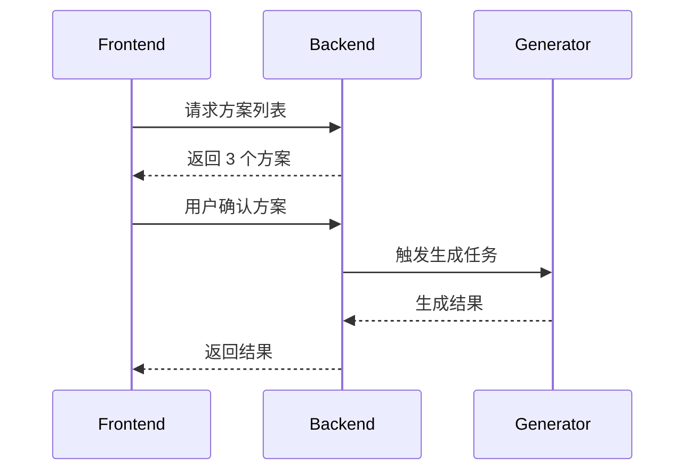

# 技术设计方案

## 目标
- 将“自动一键生成”改为“交互式方案选择 -> 确认后生成”。
- 提供 3 个可选方案，用户选择后再执行耗时任务。
- 保持现有接口兼容，新增方案选择与确认流程。

## 架构与流程
- 触发条件：当系统识别需要总结/出图时，先生成方案列表。
- 前端：展示“方案选择卡片”供用户选择与确认。
- 后端：新增方案生成接口与确认执行接口，执行真实生成逻辑。

## 技术栈与选型
- 前端：保持现有技术栈，新增卡片组件与确认流程。
- 后端：保持现有 NestJS 架构，新增方案与确认接口。
- 数据：方案可通过内存/短期缓存持久化，后续可升级为 Redis。

## 接口设计
- `POST /sessions/:id/visualization/options`
  - 返回 3 个方案：id、title、type、summary。
- `POST /sessions/:id/visualization/confirm`
  - 请求：optionId、type、chartType(可选)
  - 返回：生成结果（imageBase64/imageUrl + metadata）

## 前端设计
- 生成区域新增“方案选择卡片”UI。
- 用户点击某卡片后展示“确认生成”按钮。
- 未确认前禁用原有一键生成按钮。

## 测试策略
- 单元测试：方案生成逻辑、optionId 校验、确认执行流程。
- 接口测试：options 与 confirm 接口返回数据结构校验。
- 手工验证：选择不同方案后生成结果是否对应。

## 安全与风险
- 方案确认必须校验 optionId 有效性。
- 缓存过期策略避免方案堆积。
- 用户高频点击需防抖/去重。
